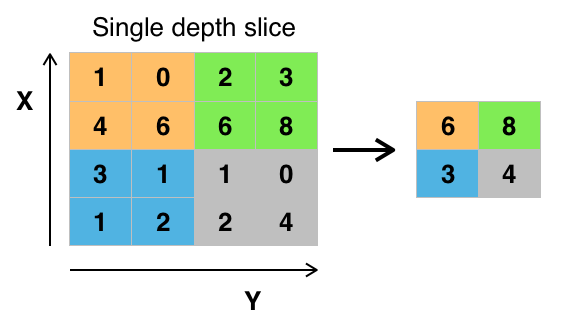

# CNN architecture

## layers:

### input layer:

1. The input could be grayscale or RGB
2. The kernels should be the same depth as the image
3. The CNN would perform better if the input layer is of certain shape, which could help us avoid illegal shapes in the pooling layers. 

### convolutional layers:

1. Local Connectivity: The kernel would learning from its receptive field, which could help preserving the **spacial structrue**, **control overfitting** and allowing the network to be **deeper with fewer parameters**.
2. Spacial arrangement: **The depth of kernel = the depth of image**; Stride controls the **overlapping extent**; Zero padding could help the kernel f**it the image** and **preserve the edge pixels**. 
3. **Parameter Sharing**: One kernel could apply to many different receptive fields, making the parameters shareable(so we can ***use less parameters***). The kernel itself could capture the non-space-specific features(or low-lever features) like edges. But for high-lever features space-specific features, we need the FC layers to learn from more features.
4. **Combine low-level local features into higher-level features**, making the recognition possible. 

[more detail](./Understand-the-Convolution-in-CNN.md)

#### filter:

1. The size of the filter is crucial. We need to find the **right level of granularity** so as to create abstractions at the proper scale. usually, 3x3, 5x5, 7x7...
2. Preserving more information about the input would require keeping the total number of activations (number of feature maps times number of pixel positions) **non-decreasing** from one layer to the next(or the receptive field would not change, the same as https://mlnotebook.github.io/post/CNN1/ :"A Note on the Receptive Field" ).

### pooling layer:

1. down-scaling
2. control overfitting
3. It's common to periodically insert a pooling layer between successive convolutional layers in a CNN architecture
4. max-pooling(better), average pooling
5. there is a recent trend towards using smaller filters(use convolutional layers down-scaling)
6. often, non-overlap pooling is better
7. usually, 2x2, 3x3 ,4x4

(wiki)

### ReLU layer:

1. It **increases the nonlinear properties**(activation function) of the decision function and of the overall network **without affecting the receptive fields** of the convolution layer.
2. activation function layer

### Fully connected layer:

1. Used to aggregate information(use many different combinations of features), transforming low-level features to high-level features(learn a more complex non-linear function).
2. The number of nodes in this layer can be whatever we want in order to do sophisticated combinations.(Sometimes it’s also seen that there are two FC layers together, this just increases the possibility of learning a complex function)
3. FC layers are usually 1D vectors
4. FC layers act as ‘black boxes’ and are notoriously uninterpretable. 
5. Because a fully connected layer occupies most of the parameters, it is prone to overfitting.

### Loss layer(output layer):

1. The "loss layer" specifies how training penalizes the deviation between the predicted (output) and true labels and is normally the final layer of a neural network. Various loss functions appropriate for different tasks may be used.
2. **Softmax loss** is used for predicting a single class of K mutually exclusive classes. **Sigmoid cross-entropy loss** is used for predicting K independent probability values in [0,1]. **Euclidean loss** is used for regressing to real-valued labels in (-inf, inf).(需要修改，说的不好，有数学理论（先学习概率论再补充）)

(from wiki)

### Dropout layer(reduce overfitting):

(Srivastava, Nitish, et al. ”Dropout: a simple way to prevent neural networks from
overfitting”, JMLR 2014)

1. A FC layer have too many parameters, which means it would develope redundant co-dependency amongst neurons. So we can drop some neurons to fix it.
2. Dropout nearly **doubles the number of epochs required to converge**. But it can improve training speed significantly for each epoch.
3. Dropout forces a neural network to learn more robust features
4. Neurons would be readded for the next iteration before another set is chosen for dropout.
5. The dropout probability of any individual is usually between 0.2-0.5
6. The dropout probability have to be much lower for input nodes, or we would lose a lot of information directly.
7. the layer is usually a FC layer with each node's drop out probability p, and thus the expected value E wouldn't change.
8. The technique seems to reduce node interactions, leading them to learn more robust features.
9. The dropout process is analogy to average different networks (add noisy point)

detailed information: http://www.jmlr.org/papers/volume15/srivastava14a/srivastava14a.pdf

###Reference:

https://mlnotebook.github.io/post/CNN1/  
https://en.wikipedia.org/wiki/Convolutional_neural_network 
https://medium.com/@amarbudhiraja/https-medium-com-amarbudhiraja-learning-less-to-learn-better-dropout-in-deep-machine-learning-74334da4bfc5
