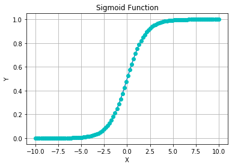
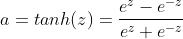

# Different Activation Function

## Basics

#### What is an activation function for?

For universal function approximation (fit any function).   
And we need nonlinear functions to perform complex nonlinear approximation (the learning ability of linear function is limited)

## pros and cons of different functions

### 1.Sigmoid (or Logistic) Function

#### background:

Sigmoid Function is a historic function(**inspired by probability theory, especially logistic regression**), which is usually used for binary classfication before. (rarely used now)  
Sigmoid curves are also common in statistics as cumulative distribution functions (which go from 0 to 1), such as the integrals of the logistic density, the normal density, and Student's t probability density functions. The sigmoid function is invertible, and its inverse is the logit function.

Many natural processes, such as those of complex system learning curves, exhibit a progression from small beginnings that accelerates and approaches a climax over time. **When a specific mathematical model is lacking, a sigmoid function is often used.**
 
 &nbsp;&nbsp;&nbsp;&nbsp;&nbsp;&nbsp;&nbsp;&nbsp;
  

#### pros:

1. Smooth gradient
2. D = (-inf, +inf), R = (0, 1)
3. Clear prediction: For x<-2, y->0; For x>2, y->1
4. easy to cal the gradient
5. **statistical properties**

#### cons:

1. Vanishing gradient: For x->+-inf, gradient->0, making the gradient descent inefficient (or barely 0 gradient)
2. Not zero-centered: So the gradient descent would perform in a inefficient zigzag way
3. Computationally expensive：exp() is expensive
  

### 2.tanh Function
 
 &nbsp;&nbsp;&nbsp;&nbsp;&nbsp;&nbsp;&nbsp;&nbsp;

#### pros:

1. Smooth gradient
2. D = (-inf, +inf), R = (-1, 1)
3. clear prediction: For x<-2, y->0; For x>2, y->1
4. easy to cal the gradient
5. more efficient than sigmoid: more steep derivative, less iteration
6. **zero centered**

#### cons: (same)

1. Vanishing gradient: For x->+-inf, gradient->0, making the gradient descent inefficient (or barely 0 gradient)
2. Computationally expensive：exp() is expensive
  

### _3.ReLU (Rectified Linear Unit) Function_

#### pros:(form wiki)

1. **Biological plausibility**: One-sided, compared to the antisymmetry of tanh
2. Sparse activation: In a randomly initialized network, only about 50% of hidden units are activated
3. **Better gradient propagation**: Fewer vanishing gradient problems
4. Efficient computation: df = C or 0
5. Scale-invariant: max(0, ax) = amax(0, x) for a>0

#### cons:
1. Not zero-centered (Zigzag)
2. Unbounded