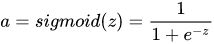
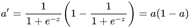
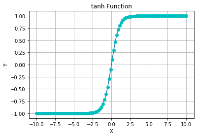
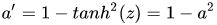
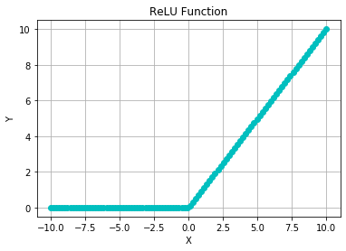
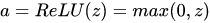
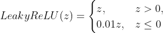
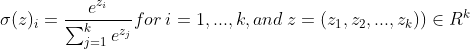

# Different Activation Function

## Basics

#### What is an activation function for?

For universal function approximation (fit any function).   
And we need nonlinear functions to perform complex nonlinear approximation (the learning ability of linear function is limited)

## pros and cons of different functions

### 1.Sigmoid (or Logistic) Function

#### background:

Sigmoid Function is a historic function(**inspired by probability theory, especially logistic regression**), which is usually used for binary classfication in the output layer before. (rarely used now)  
Sigmoid curves are also common in statistics as cumulative distribution functions (which go from 0 to 1), such as the integrals of the logistic density, the normal density, and Student's t probability density functions. The sigmoid function is invertible, and its inverse is the logit function.

Many natural processes, such as those of complex system learning curves, exhibit a progression from small beginnings that accelerates and approaches a climax over time. **When a specific mathematical model is lacking, a sigmoid function is often used.**
 
 &nbsp;&nbsp;&nbsp;&nbsp;&nbsp;&nbsp;&nbsp;&nbsp;
  

#### pros:

1. Smooth gradient
2. D = (-inf, +inf), R = (0, 1)
3. Clear prediction: For x<-2, y->0; For x>2, y->1
4. easy to cal the gradient
5. **statistical properties**

#### cons:

1. Vanishing gradient: For x->+-inf, gradient->0, making the gradient descent inefficient (or barely 0 gradient)
2. Not zero-centered: So the gradient descent would perform in a inefficient zigzag way
3. Computationally expensive：exp() is expensive
  

Usage: binary classfication in the output layer, ordianary layer (rarely used now) 

### 2.tanh Function
tanh is usually slightly better than sigmoid function
 
 &nbsp;&nbsp;&nbsp;&nbsp;&nbsp;&nbsp;&nbsp;&nbsp;

#### pros:

1. Smooth gradient
2. D = (-inf, +inf), R = (-1, 1)
3. clear prediction: For x<-2, y->0; For x>2, y->1
4. easy to cal the gradient
5. more efficient than sigmoid: more steep derivative, less iteration
6. **zero centered**

#### cons: (same)

1. Vanishing gradient: For x->+-inf, gradient->0, making the gradient descent inefficient (or barely 0 gradient)
2. Computationally expensive：exp() is expensive
  

Usage: almost the same as the Sigmoid function

### _3.ReLU (Rectified Linear Unit) Function_

It is a non-linear function 
Much better than sigmoid and tanh in CNN

 

#### pros:(form wiki)

1. **Biological plausibility**: One-sided, compared to the antisymmetry of tanh, and it has sparse activation (x>0 means activated)
3. **Better gradient propagation**: Fewer vanishing gradient problems
4. Efficient computation: df = 1 or 0, so it can speed up the convergence of stochastic gradient descent algorithms.
5. Scale-invariant: max(0, ax) = amax(0, x) for a>0

#### cons:
1. Not zero-centered (Zigzag)
2. Unbounded (Krizhevsky et al.2012 used Local Response Normalization,LRN to fix it, this method is highly controversial)
3. Dying ReLU Problem: Usually, if the learning rate was set too high, the z would stuck in the z<0 zone(gradient = 0) (use leaky ReLU or set the bias term=C>0 would help)

#### Variants:

Leaky ReLU:  
pros:  it can solve the dying ReLU problem
cons: not consistent for negative input values

#### Usage:

1. usually deep networks
2. can serve as the activition function in CNN
3. If you have no idea what to use in the hidden layer, use it

### ***4.Softmax Function***

#### background knowledge (form wiki):

The Softmax function is a **smooth approximation to the arg max function** (https://en.wikipedia.org/wiki/Arg_max), which could converge compactly on the non-singular set.(small changes in input would rarely cause large changes in the output)

In **probability theory**, the output of the softargmax is **a probability distribution** over K different possible outcomes.

In **Thermodynamics**, it is the Boltzmann distribution, The Boltzmann distribution is a probability distribution that gives the probability of a certain state as a function of that state's energy and temperature of the system to which the distribution is applied.

#### pros:

1. Can be interpreted as probabilities
2. Can be used for negative numbers, and D = (-inf, +inf), R = (0, 1)
3. Robust: small changes in input would rarely cause large changes in the output

#### cons:

1. inefficient computation

#### Usage:

It is nearly always used in multi-classification problem, in the fully connected output layer.

### Swiss:

https://arxiv.org/pdf/1710.05941v1.pdf?source=post_page---------------------------