# Skip-gram model

[ori paper1](https://arxiv.org/pdf/1301.3781.pdf%C3%AC%E2%80%94%20%C3%AC%E2%80%9E%C5%93)
[ori paper2](https://papers.nips.cc/paper/5021-distributed-representations-of-words-and-phrases-and-their-compositionality.pdf)

## 1.What is this model used for?

1. ANS:The model is used for generating "high quanlity" word vectors.    
2. High quanlity means that similar words is close in the vector space, basic linear operation would make sense(vec(king) - vec(man) + vec(woman) = vec(queen)), and etc.

## 2.How dose the model achieve the "high quanlity"?

1. ANS: Maximizing the likelihood of the context words given the center word would help, because the context and the meaning of the word are closely related.

## 3.Details about the basic skip-gram model

1. There is a word window moving along the passage to capture different sets of center word + context words.
2. Words around the center word(context word) were used to training a model(Using multivariate softmax regression) by maximizing the occurence of context words.   
       
**The training samples serve as "index" of O and C in the loss function J.**    
(from:http://mccormickml.com/2016/04/19/word2vec-tutorial-the-skip-gram-model/)
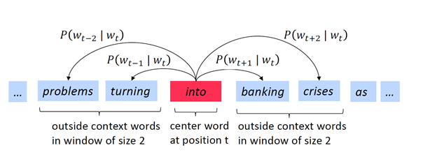
3. maximizing formula:       
(from:https://medium.com/analytics-vidhya/maths-behind-word2vec-explained-38d74f32726b)    
The maximum likelihood estimation(MLE) is used on all single words to learn a model, which can estimate the occurence probabilities of all words given the center word.        
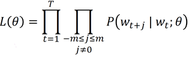   
But the loss function above is hard to optimize, so we can minimize an equivalent one([Negative Log Likelihood](https://glassboxmedicine.com/2019/12/07/connections-log-likelihood-cross-entropy-kl-divergence-logistic-regression-and-neural-networks/)) instead:     
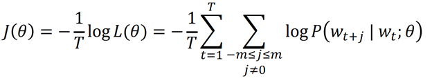       
And the softmax function was used to transform a vector into a pobability distribution.         
We will use Uw when w is the context word and Vw when w is the center word             
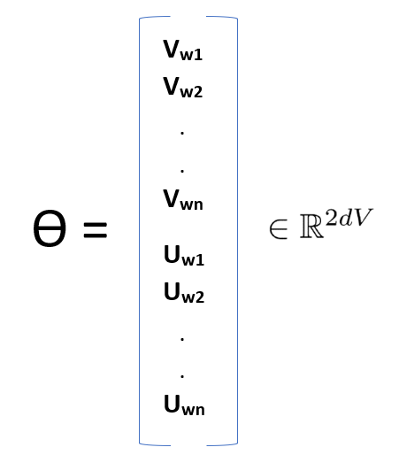

(Theta == Weights in the hidden layer) (2 vectors U and V -> easier to optimization than a single vector)    
4. **The conditional probability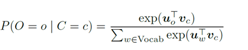, where the O respects to the center word and the Cs respect to the context words; The numerator corresponds to the context words in the word window and the denominator corresponds to the other words in whole vocab(or Negative samples, they are of lower probability)**.

4. The Architecture    
(from:http://mccormickml.com/2016/04/19/word2vec-tutorial-the-skip-gram-model/) 
        
What we want is the Weights in the hidden layer**(U and V are used to construct the word vectors(usually word_vec = U + V)**.      
**For Batchsize = t, the input is a (words x t) matrix.**    

6. The first layer is just a linear layer(without activation function);And all the weights are randomly initialized.

5. drawbacks of this original model: too many parameters in the hidden layer, the denominator is computationally expensive

## 4.Improvements

### Hierarchical softmax

1. uses a Huffman tree to reduce calculation.
2. Hierarchical softmax works better for infrequent words.
3. Naturally, as training epochs increase, hierarchical softmax stops being useful.

### Negative sampling

significantly decreasing training time & improving performance

#### procedure

1. K words of unigram distribution would be selected as negative samples(K = 5-20 for small datasets, K = 2-5 for large datasets)(These k words belong to the words out of the word window).
2. The probability of a single word i to be selected: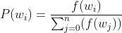(f refers to the frequency; **Words with high frequency are likely to be selected; And intuitively, words with low frequency only have minor impact on the loss function: exclude them would do no harm to the backprop**)
3. It seems that averaging the probability a little bit works better: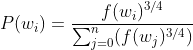(3/4 is a hyperparameter)
4. Redefine the loss function that only k negative samples(words with lower probability) would be used: 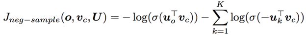

### Subsampling of frequent words

1. In very large corpora, the most frequent words can easily occur hundreds of millions of times (e.g.,“in”, “the”, and “a”). Such words usually provide less information value than the rare words.
2. To counter the imbalance between the rare and frequent words, we used a simple subsampling approach: each word wi in the training set is ***discarded***(it will never be used again) with probability computed by the formula: 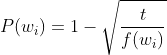, where f is the frequency and the t is a chosen threshold typically around 10e-5.
3. e.g. t = 1e-5: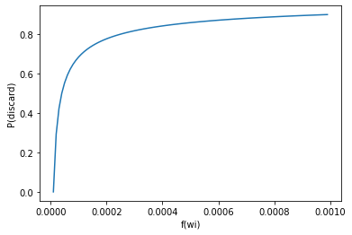

## 5.model training tricks

1. discard rare words
2. vector dimensionality 300 and context size 5+
3. the most crucial decisions that affect the performance are the choice of the model architecture, the size of the vectors, the subsampling rate, and the size of the training window.

## 6. results

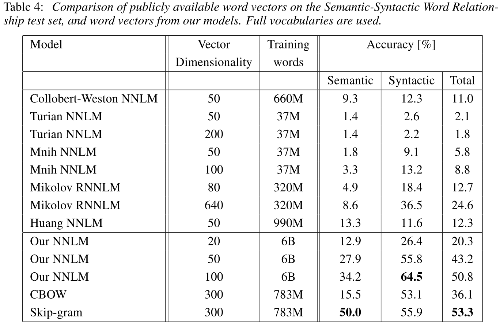     
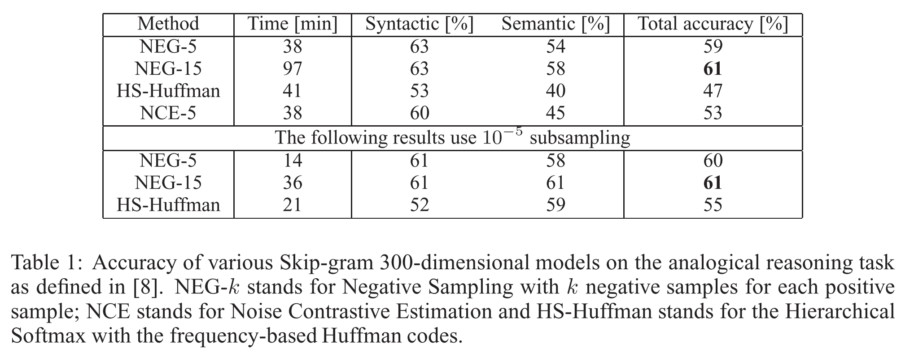
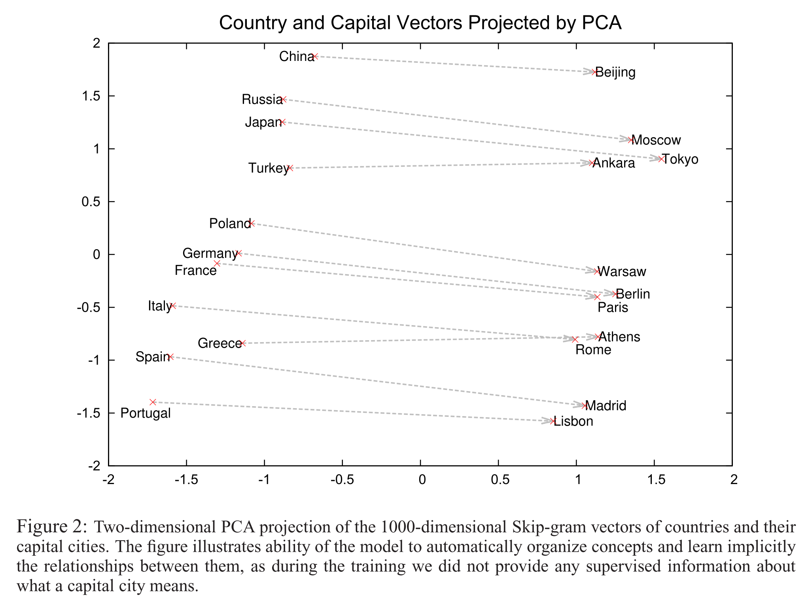    
 
## 7.references

representations of word vector:     
[10] G.E. Hinton, J.L. McClelland, D.E. Rumelhart. Distributed representations. In: Parallel dis- tributed processing: Explorations in the microstructure of cognition. Volume 1: Foundations, MIT Press, 1986.     
[8] J. Elman. Finding Structure in Time. Cognitive Science, 14, 179-211, 1990.      
[26] D. E. Rumelhart, G. E. Hinton, R. J. Williams. Learning internal representations by back- propagating errors. Nature, 323:533.536, 1986.       
(NNLM)[1] Y. Bengio, R. Ducharme, P. Vincent. A neural probabilistic language model. Journal of Ma- chine Learning Research, 3:1137-1155, 2003.      

NCE:   
[4] Michael U Gutmann and Aapo Hyv¨arinen. Noise-contrastive estimation of unnormalized statistical mod- els, with applications to natural image statistics. The Journal ofMachine Learning Research, 13:307–361, 2012.          
[11] Andriy Mnih and Yee Whye Teh. A fast and simple algorithm for training neural probabilistic language models. arXiv preprint arXiv:1206.6426, 2012.     

