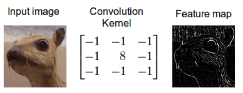
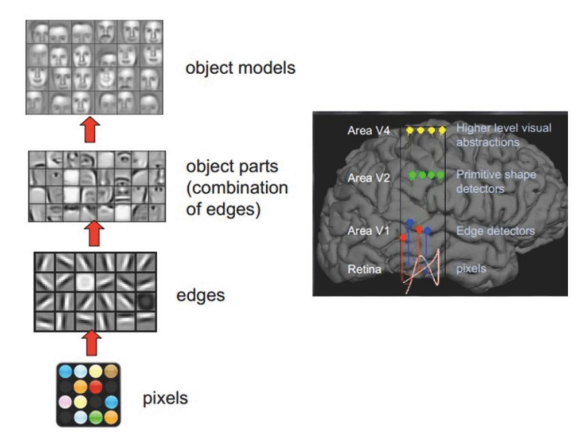
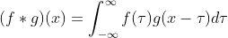
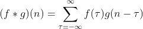
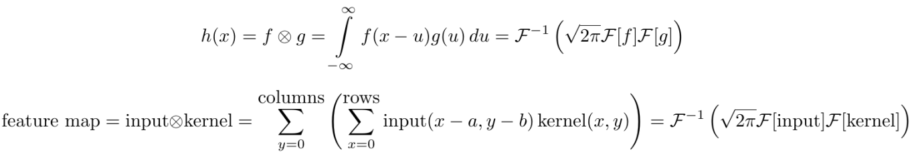

## Understand Convolution in CNN

#### Intuitively：
1. Mix information according to a specific rule(recipe). 
2. Different convolutional kernels(or filters) will provide **different recipes for mixing**. 
3. Different recipes will capture local features in the receptive field and finally learn different features of the picture. 
4. The kernel will get better and better at **filtering for relevant information**. 
5. The kernels will learn to **solve specific tasks** accroding to the training data. 

e.g. A convolution kernel learnt to detect edges. 
(from wiki)

#### Biologically:

1. Individual cortical neurons respond to stimuli **only in a restricted region** of the visual field known as the receptive field.
2. The receptive fields of different neurons **partially overlap** such that they cover the entire visual field.
3. Animal optic nerve would maintain the **spacial features** of pictures.

(from web)

#### Mathematically:

I would like to describe it in an evolving way

1. translation + superposition of functions
2. **weighted superposition of one function on another**
3. Continuous consequences of transient behavior (e.g. If you are taking a medicine, the drug concentration in you blood would decrease over time. If you take the medicine repeatedly, we can use the convolution to cal the concentration)
4. We can speed up and stabilize the computation of convolutions with Fourier transforms

(wiki)  

continous: 
discrete:  
(The integral could be [0, a] or something else)

More details:  
https://colah.github.io/posts/2014-07-Understanding-Convolutions/  
https://www.zhihu.com/question/22298352/answer/637156871

#### Image processing:

1.We can think of images as two-dimensional functions. Many important image transformations are convolutions where you **convolve the image function with a very small, local function called a “kernel**.”

from timdettmers.com) 
Mathmatically, we should turn the kernel upside-down(rotated by 180 degrees) before convolve, but in  CNN, it doesn't hurt.

   
2.Some kernels are used to capture the features. And, CNN can train specific task-oriented kernels

e.g. 
    
You can see that the kernel can capture the vertical lines or horizontal lines in the picture.

more details about the kernel: [superbasic code](./code/img_kernel/img_kernel.py)

#### fluid mechanics:

The kernel served as a collector of information. If the pixels are bottles of salt water with different sanity, the kernel would **mix them according to the probability distribution**(the numbers in the kernel), and create salt water containing specific information.

#### Neural Network

1. **mix** information
2. maintain **spacial structure**(more information)
3. **down-scaling**
4. CNNs are **regularized versions** of multilayer perceptrons(they take advantage of the hierarchical pattern in data and assemble more complex patterns using smaller and simpler patterns. Therefore, on the scale of connectedness and complexity, CNNs are on the lower extreme.So they are not very prone to overfitting)

#### Reference:
https://timdettmers.com/2015/03/26/convolution-deep-learning/ 
https://colah.github.io/posts/2014-07-Understanding-Convolutions/ 
https://www.zhihu.com/question/22298352/answer/637156871 
https://mlnotebook.github.io/post/CNN1/ 

