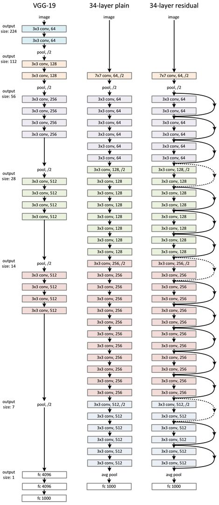
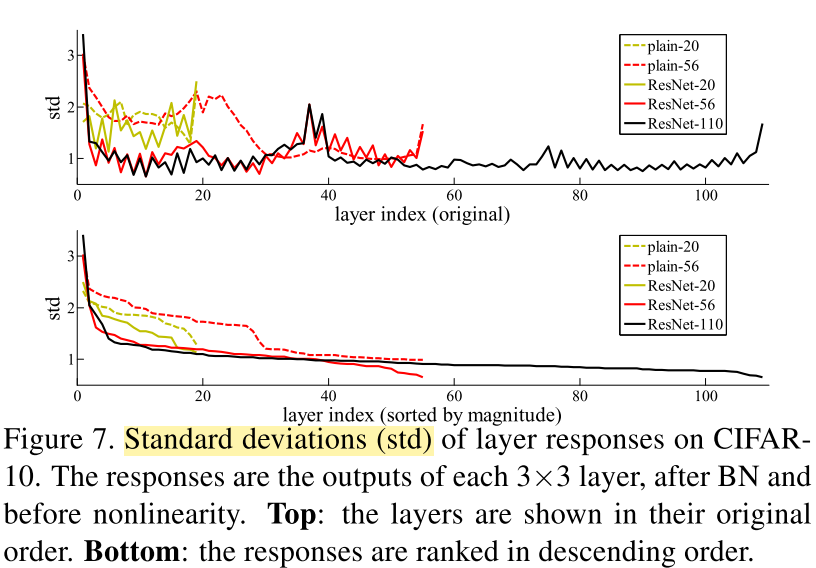
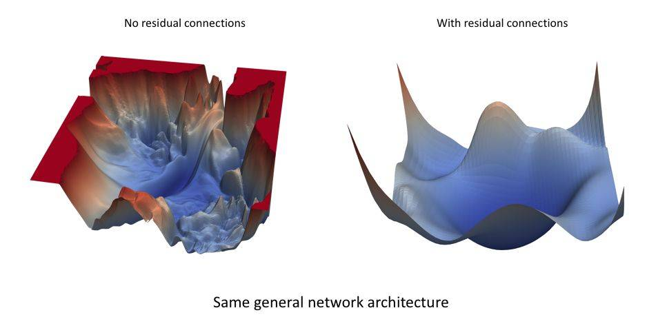
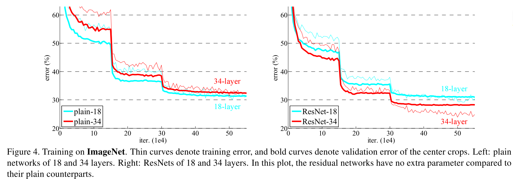
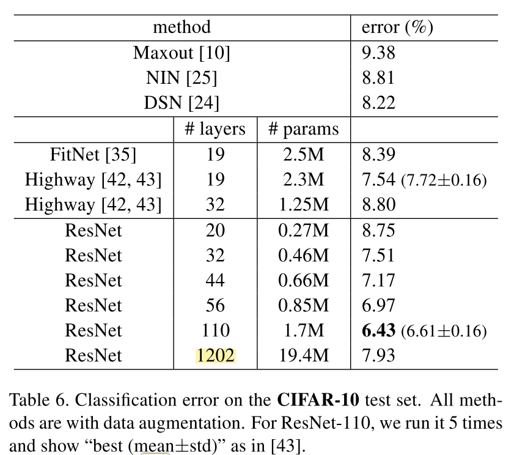
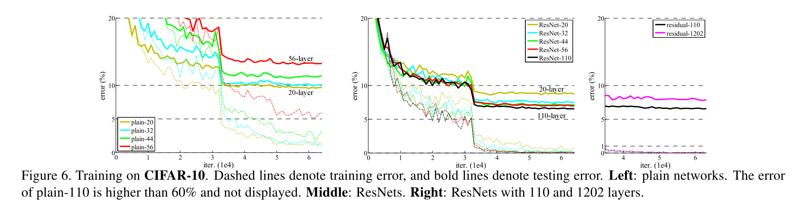

# Deep Residual Learning for Image Recognition

## Summary

1. Use short-cut connection for residual function learning
2. Use conv+relu+BN or conv+BN+relu to reduce vanishing/exploding gradients problem
3. Degradation problem can't be solved by doing more iterations.
4. The bottle-neck structure can be useful to reduce training time
5. BN is very useful

## Research Object

CNN for imagenet

## Main Problems

1. When the network is very deep -> vanishing/exploding gradients (Usually, we use normalized initialization [23, 9, 37, 13] and Batch normalization[16] to fix it)
2. When the network is very deep and able to converge -> degradation(accuracy will rise untill saturated and then drop)(not caused by overfitting)
3. adding more layers to a suitably deep model leads to higher training error
3. The constructed 34-layer-plain(add more layers to VGG-19 would not perfrom better, even worse, and it cannot learn the identity mapping perfectly)

## Method: Add residual blocks

### Learn the residual(H(x) - x) instead

1. It's easier to optimize the residual mapping (F(x) = H(x) - x, where H(x) is the original mapping)(counter the degradation problem)
2. The formulation F(x) + x can be achieved by using shortcut connections(identity mapping in resnet)
3. Identity short-cut connections[2, 34, 49] add neither extra parameter nor computa- tional complexity.
4. Deep residual nets can easily enjoy accuracy gains from greatly increased depth, which means it has better generalization performance
5. There is no dropout in resnet
5. learned residual functions have small responses -> identity mappings provide reasonable preconditioning
6. When there are more layers, an individual layer of ResNets tends to modify the response signal less.
7. residual functions might be generally closer to zero than the non-residual functions（easy to learn）

  
(response comparision; The respon is analogious to the eletronic pulse)

### details about residual block

1. The block have to contain more than 1 layer, or it would be very similar to a linear layer, making it useless.
2. If the num of input-channels and the num of output-channels of the block are inconsistent, Use additional 1x1conv+bn to perform down-sampling. (or add zero padding to still perform identity mapping)
3. For resnet50,101,152, we are going to use bottle neck block to reduce dimension and thus reduce training time

## Evaluation

 

 

 ].    
(res-1202 -> perhaps overfitting )

## Reference 

(Normalization)     
[9] X. Glorot and Y. Bengio. Understanding the difficulty of training deep feedforward neural networks. In AISTATS, 2010.

[13] K. He, X. Zhang, S. Ren, and J. Sun. Delving deep into rectifiers: Surpassing human-level performance on imagenet classification. In ICCV, 2015.

[16] S. Ioffe and C. Szegedy. Batch normalization: Accelerating deep network training by reducing internal covariate shift. In ICML, 2015.

[23] Y. LeCun, L. Bottou, G. B. Orr, and K.-R.M¨uller. Efficient backprop. In Neural Networks: Tricks ofthe Trade, pages 9–50. Springer, 1998

[37] A. M. Saxe, J. L. McClelland, and S. Ganguli. Exact solutions to the nonlinear dynamics of learning in deep linear neural networks. arXiv:1312.6120, 2013.

[33] S. Ren, K. He, R. Girshick, X. Zhang, and J. Sun. Object detection networks on convolutional feature maps. arXiv:1504.06066, 2015.

(FitNet)[35] A. Romero, N. Ballas, S. E. Kahou, A. Chassang, C. Gatta, and Y. Bengio. Fitnets: Hints for thin deep nets. In ICLR, 2015

(HighWay)[42] R. K. Srivastava, K. Greff, and J. Schmidhuber. Highway networks. arXiv:1505.00387, 2015.

## W P
