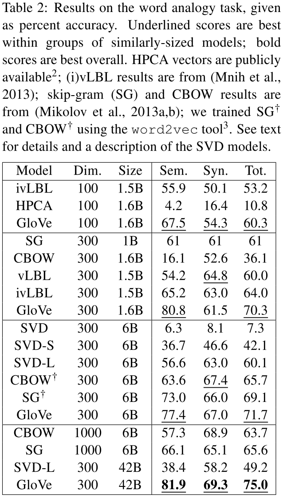

# GloVe

## Summary

1. Mathematical thought: reverse construction from demand
2. Reverse construction: initiate a general formula and then specificize it based on demand
3. The GloVe model performs significantly better than the other ealier baselines, **often with smaller vector sizes and smaller corpora**
4. word vector = W + W~ is more robust
5. The pros and cons of global matrix factorization and local context window methods
4. basic SVD model does not scale well to large corpora

## Research object

word vector

## Main Problems

1. global matrix factorization methods(e.g. LSA) -> two words co-occur with "the" or "and", for example, will have a large effect on their similarity despite conveying relatively little about their semantic relatedness, so this method do relatively poorly on the word analogy task
2. local context window methods(e.g. skip-gram) -> they poorly utilize the statistics of the corpus since they train on separate local context windows instead of on global co-occurrence counts

## Method

### Mathmatical reverse construction

#### basic notations

 = the number of times word j occurs in the context of word i(word window).     
 = the number of times any word appears in the context of word i.      

#### Mathmatical thinking: grasp the key points

"Compared to the raw probabilities, the ratio is better able to distinguish relevant words (solid and gas) from irrelevant words (water and fashion) and it is also better able to discriminate between the two relevant words."        

>

What deserves to be mentioned is that the P(k|ice) is relatively higher when k = water, which reveals the similarity between water and ice. It seems that the formula failed to capture this similarity, but actually when i = ice, j = water, this similarity could be captured.

#### Mathmatical thinking: construction

Initially, we should analysis what we have already got and what we want to calculate.

We have: The useful Pik/Pjk         
We want: The word vector w     
So we need: construct a mapping F to encode the information.     
Based on the skip gram, the mapping is a neural network and the word vectors are  the weights in the hidden layer.
We can construct F: .     

In [4] it suggests that: for certain types of neural networks, training multiple instances of the network and then combining the results can help **reduce overfitting and noise** and generally improve results.      
As a result, the model generates two sets of word vectors, W and W~, which was randomly initiated and perform equivalently. And the final word vector is W + W~      

Based on it, we can construct F:  (very similar to the method used in skip gram)

The w are vectors, so the F can be simplified naturally: 

But the F is now turning vectors to scalars, which would **obfuscate the linear structure we are trying to capture**(through the NN, the vector dimensions are mixed in undesirable ways).    

So we can use a uniform dot product to restrict the input into a scalar: .    

Moreover, for word-word co-occurrence matrices, the distinction between a word and a context word is arbitrary and that we are **free to exchange the two roles**. But in , the **W and W~ are non-exchangeable**.   

First, we require that F be a homomorphism between the groups (R,+) and (R>0, ×), i.e. we could let: .
   
For any , F could be exp.    
And we need .   
Then the equation should be: 
The log(Xi) is independent of k so it can be absorbed into a bias bi for wi: , where the bi + bk~ -> log(Xi) + original_bias.      
But it is actually ill-defined since the logarithm di- verges whenever its argument is zero.    
If we shift the logarithm: log(Xik)->log(1+Xik), it weights all co-occurence equally, including words happen rarely or never(the rare words tend to overweighted).    

To solve this problem, we can construct a function f(Xij) to restrict the weights. For the term with yellow line, it is the squared difference of the real value and the estimated value.  

> 
 
When alpha = 3/4, Xmax = 100, it will have a better performance.  

 

### data preprocessing

1. tokenize and lowercase each corpus
2. build a vocabulary of the 400,000 most frequent words
3. construct a matrix of co- occurrence counts X

### Word windows

**vector d=300, window l=5+ is better**

**Important detail: in the word windows, the word with distance d to the center word would only contribute 1/d to the total count**.(very distant word pairs are expected to contain less relevant information about the words’ relationship to one another)

### training details

>"For all our experiments, we set Xmax = 100, α = 3/4, and train the model using AdaGrad (Duchi et al., 2011), stochastically sampling non-zero elements from X, with initial learning rate of 0.05. We run 50 iterations for vectors smaller than 300 dimensions, and 100 iterations otherwise. Unless otherwise noted, we use a context of ten words to the left and ten words to the right."

### train on well structured data like wiki

> 

## Evaluation

word analogy task
 

word similarity task
 

GloVe vs Word2Vec
 

### Complexity analysis

it's too hard for me to understand.

## Reference
[3]Yoshua Bengio. 2009. Learning deep architectures for AI. Foundations and Trends in Machine Learning.       
[4]Dan C. Ciresan, Alessandro Giusti, Luca M. Gam- bardella, and J¨urgen Schmidhuber. 2012. Deep neural networks segment neuronal membranes in electron microscopy images. In NIPS, pages 2852–2860.           
(LSA)[9]Scott Deerwester, Susan T. Dumais, George W. Furnas, Thomas K. Landauer, and Richard Harshman. 1990. Indexing by latent semantic analysis. Journal of the American Society for Information Science, 41.
