# Image Style Transfer Using Convolutional Neural Networks 

## Summary

## Research Object

Image style transfer 

## Main Problems

Limitations about texture transfer: Only low-level(pixel value) features were used to generate new image

## Method

### Architecture

>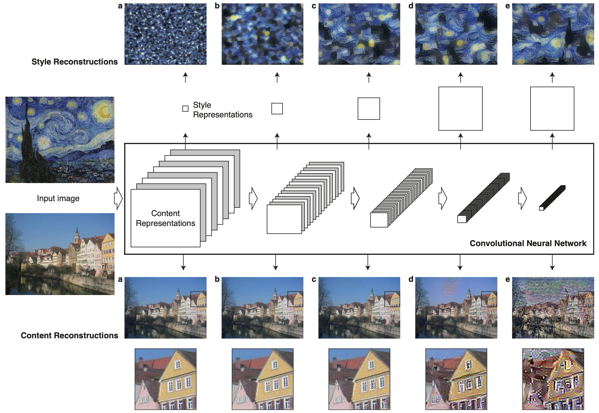

>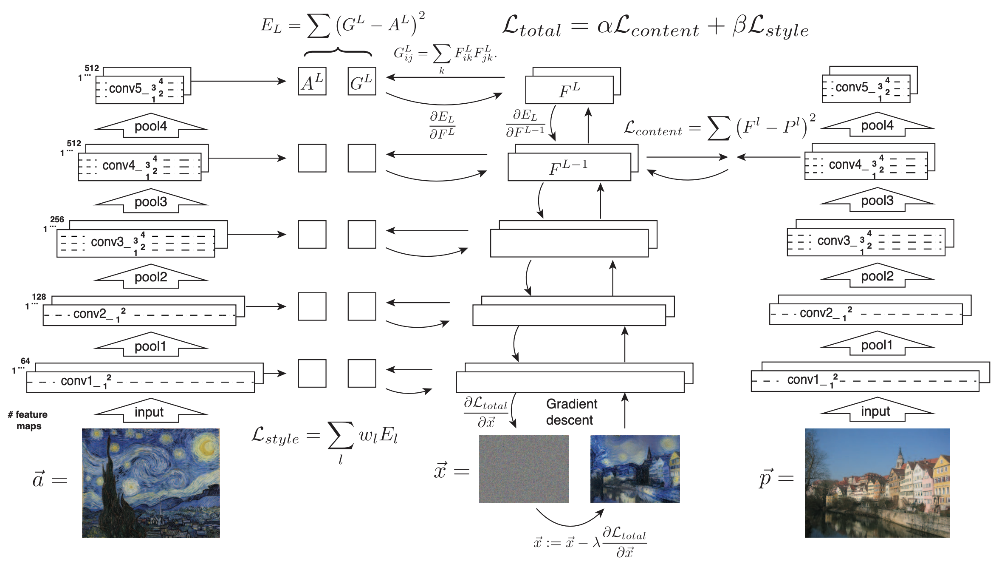

a: the style image 
x: the white noise used to generate the transferred output 
p: the content image 

The features of style image, content image and the white noise are extracted by the convolutional layer.  

Core idea: 

1. Minimize the content loss(feature distance) and style loss(gram matrix distance) simultaneously in order to generate a transferred image. 
2. The style representations should be spatially invariant(->gram matrix of features is spatially invariant)    
3. The content representations and style representations can be somehow distangled.   

### Loss definition

P -> the features of the content image     
F -> the features of the white noise(generated image)     
A -> the features of the style image      
G -> the gram matrix of F(and there are other useful style representations)      

The content loss is the L2 loss between a single high level content feature map and a white noise feature map.      
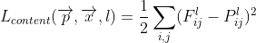        

The Style Representations is defined as the gram matrix of the content representations which is spacially invariant.    

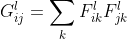

The style loss is the summation of the L2 losses      
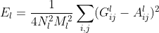       
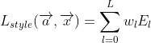

Finally, the total loss is controlled by the content weight and the style weight    
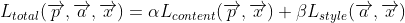     

Weight controlling examples:     
>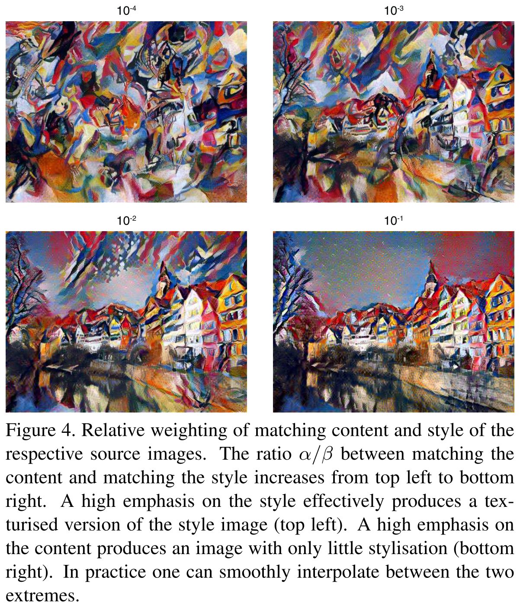   

## Evaluation

### content representation in different layers

>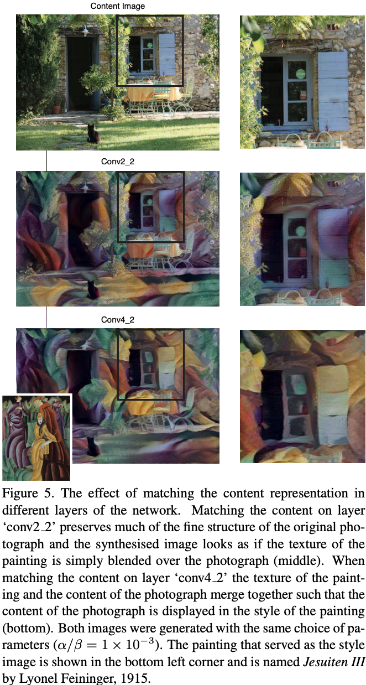  

low level features: close to pixel space
high level features: more distortion and abstract

### different white noise -> different image

>It should be noted that only initialising with noise allows to generate an arbitrary number of new images (Fig 6 C). Initialising with a fixed image always deterministically leads to the same outcome (up to stochasticity in the gradi- ent descent procedure)
>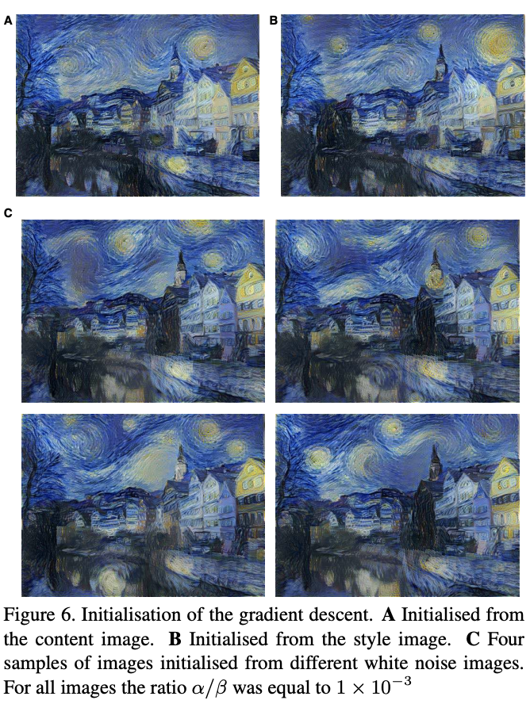  

### noisy Photorealistic style transfer

You can see that there are many pixel noises, which means that it cannot preserve the high resolution features perfectly.        
>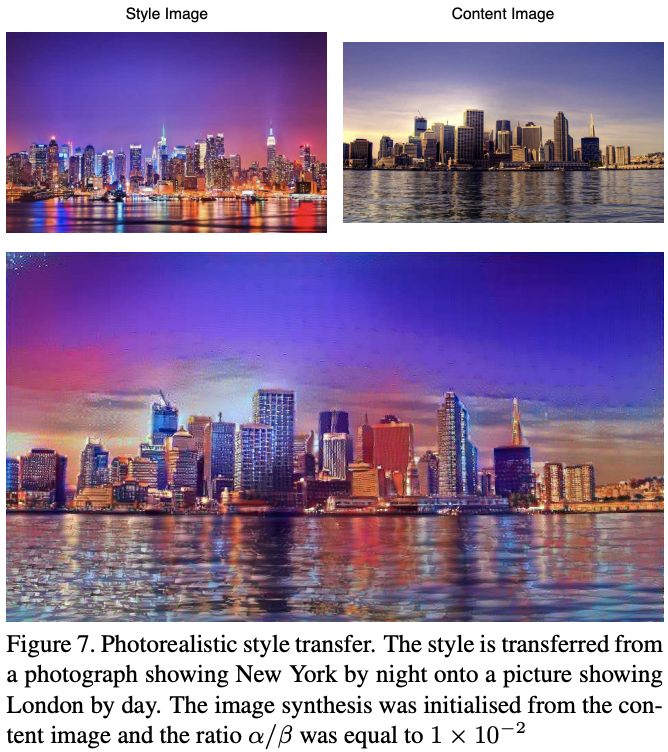      

### redundant computations -> extremely slow

This method need to iterate 200~300 times to generate a single high resolution image.   
