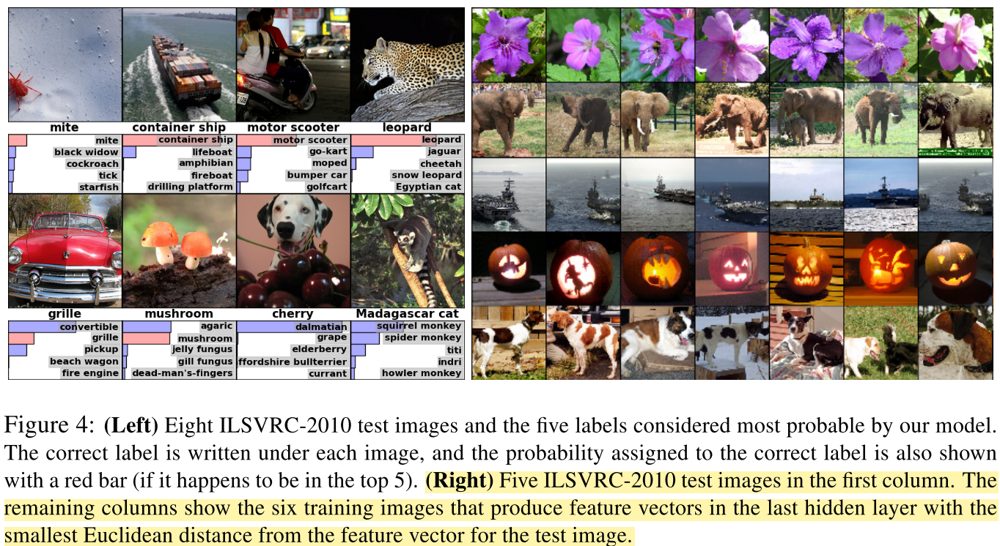

# ImageNet Classification with Deep Convolutional Neural Networks

## Summary

1. The depth of NN is critical
2. CNN is useful
3. Use ReLU as default
4. Data Augmentation & Dropout -> reduce overfitting
5. conv+relu+pooling
6. The CNN serves as a feature extractor which can project the images into a space with nice property

## Research Object

CNN for imagenet

## Main Problems

1. Need a model with large learning ability for large datasets.
1. **Very deep neural networks are prone to overfitting.**
2. Removing any convolutional layer resulted in inferior performance.
3. The network's size is limited by the memory of GPU.

## Method

### pretreatment on the dataset

1. rescaled the image such that the shorter side was of length 256
2. cropped out the central 256×256 patch from the resulting image
3. subtracting the mean activity over the training set from each pixel
4. random crop 224x224 imgs for data augmentation

### special features:

#### 1. ReLU(f(x) = max(0, x))
 1. **fast**(non-saturating)
 2. Dead ReLU problem, so the author initialized the neuron biases in the second, fourth, and fifth convolutional layers, as well as in the fully-connected hidden layers, with the constant 1(provide positive values).
 
For comparision: [Different-Activation-Function](../Different-Activation-Function.md) 
 
#### 2. Training on multiple GPU(for broblem 4)

1. Spread the net across two GPUs(the GPUs communicate only in certain layers)
2. Acceleration

#### 3. Local Response Normalization

1. It can reduce overfitting(sometimes)
1. Idea: In Neurobiology, an acitivated neuron will inhibit surrounding neurons.
2. I seldom use this method, because sometimes it won't improve accuracy

#### 4. overlap pooling

1. The pooling kernels will overlap
2. I seldom use this method, because sometimes it won't improve accuracy

### Reduce overfitting

#### 1. Data Augmentation

1. Extracting random 224x224 patches(and their horizontal reflection) from 256x256 img to generate new imgs.
2. Altering the intensities of the RGB : 
(detailed process: https://deshanadesai.github.io/notes/Fancy-PCA-with-Scikit-Image)

#### 2. Dropout 

1. Combining the predictions of many different models is a very successful way to reduce test errors, but it's too expensive. And dropout could be an inexpensive way to achieve it(use random subsets). 
2. It will learn more robust features 
3. Dropout roughly doubles the number of iterations required to converge(but each iteration is accelerated)
4. **The data need to be transformed at the test time.**
5. This technique reduces complex co-adaptations of neurons.
6. check reference [10] and [CNN-Architecture](../CNN-Architecture.md)

#### 3. weight decay

0.0005

1. reduce overfitting
2. reduce the training error	(why?)

### Other details

1. stochastic gradient descent with a batch size of 128 examples, momentum of 0.9, and weight decay of 0.0005
2. initialized the weights in each layer from a zero-mean Gaussian distribution with standard de- viation 0.01
3. divide the learning rate by 10 when the validation error rate stopped improving with the current learning rate
4. some positive bias terms for ReLU
5. After the image's 'pixel space' transformed by the CNN layers, it enters a 'high-level-feature space' where the L2 distance could measure the 'image distance' precisely.     

 

### Architecture

1. conv-relu-pooling-LRN
2. conv-relu-pooling-LRN
3. conv-relu
4. conv-relu
5. conv-relu-pooling
6. fc-relu-dropout
7. fc-relu-dropout
8. fc-softmax

[Code](../code/nets/AlexNet.py)

## Evaluation

1. The network has learned frequency- , orientation-, and color-selective kernels. (GPU2 has learned color-specified kernels while GPU1 doesn't, and it's due to random weight initialization)
2. Off-center objects could be learnt
3. top-5 labels appear reasonable (leopard, cat ...)
4. the depth of CNN is critical

## Reference 

[4] D. Cire¸san, U. Meier, and J. Schmidhuber. Multi-column deep neural networks for image classification. Arxiv preprint arXiv:1202.2745, 2012.

[5] D.C. Cire¸san, U. Meier, J. Masci, L.M. Gambardella, and J. Schmidhuber. High-performance neural networks for visual object classification. Arxiv preprint arXiv:1102.0183, 2011

(dropout)[10] G.E. Hinton, N. Srivastava, A. Krizhevsky, I. Sutskever, and R.R. Salakhutdinov. Improving neural net- works by preventing co-adaptation of feature detectors. arXiv preprint arXiv:1207.0580, 2012.

(data augmentation)[25] P.Y. Simard, D. Steinkraus, and J.C. Platt. Best practices for convolutional neural networks applied to visual document analysis. In Proceedings ofthe Seventh International Conference on Document Analysis and Recognition, volume 2, pages 958–962, 2003.

## W P