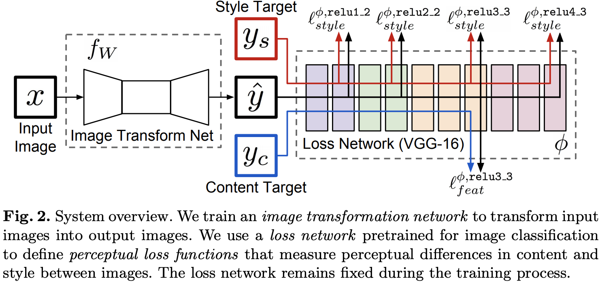
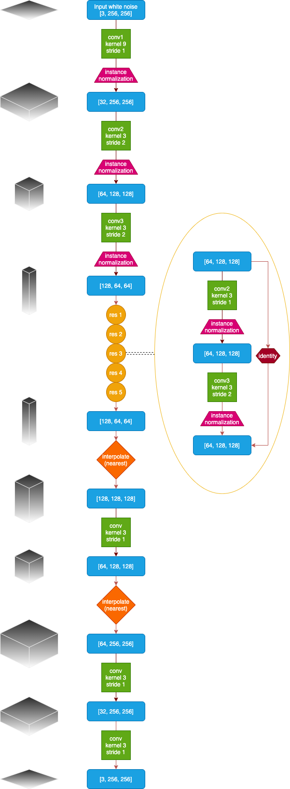
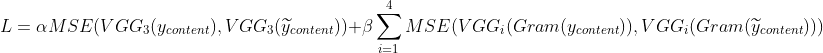
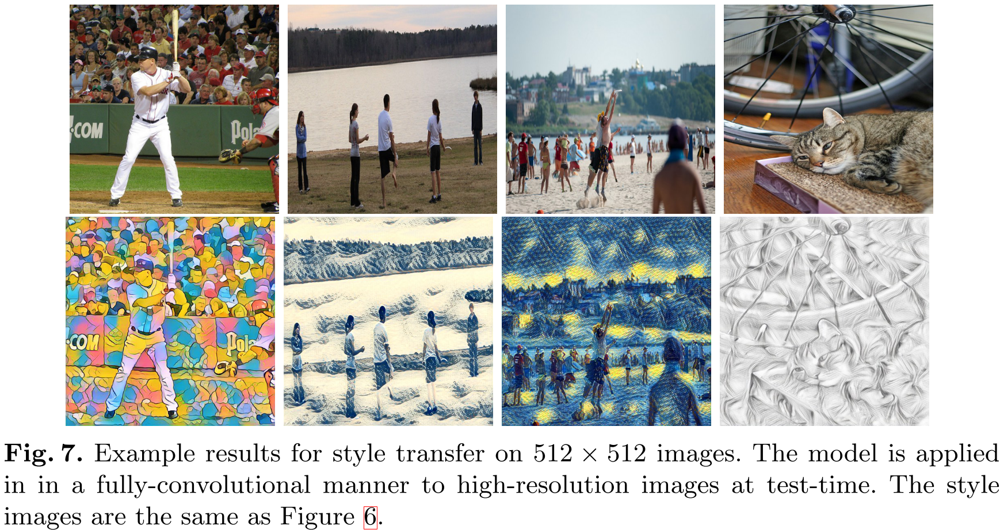
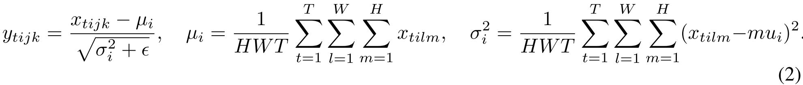
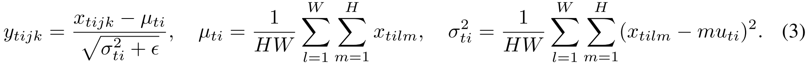

# Real-Time Style Transfer, IN, CIN, AdaIN

(Vanilla)[Perceptual Losses for Real-Time Style Transfer and Super-Resolution ](https://arxiv.org/abs/1603.08155)     
(IN)[Instance Normalization: The Missing Ingredient for Fast Stylization](https://arxiv.org/abs/1607.08022)       
(CIN)[A LEARNED REPRESENTATION FOR ARTISTIC STYLE](https://arxiv.org/abs/1610.07629)      
(CoMatch)[Multi-style Generative Network for Real-time Transfer](https://arxiv.org/abs/1703.06953)          
(AdaIN)[Arbitrary Style Transfer in Real-time with Adaptive Instance Normalization](https://arxiv.org/abs/1703.06868)

## Summary

1. Style transfer can be achieved by a single forward propagation
2. Generally, the perceptual loss is better than the per-pixel loss
2. perceptual loss + gram matrix or other statistics(MRF, other second-order statistics)
3. Cnn could be used to define losses in image reconstruction tasks(VGG)
4. With the affine transformation after the normalization, style transfer can be done without extra training.

## Method

### Pipeline 

Overall: 

>

The transformer(with [instance normalization](https://arxiv.org/abs/1607.08022), Ulyanov et al.): 

1. The architecture of the transformer is inspired by the network used in semantic segmentation.        
2. Transposed convolution in the original paper is replaced by a nearest-neighbor upsampling followed by a convolution

### VGG

The VGG is a **fixed**(no gradient descent) network which has been pre-trained on ImageNet. The VGG serves as a feature extractor to provide semantic and perceptual informations.  Then, the extracted features could be used to define loss function.    

### Downsample and Upsample(Transformer)

#### Downsample: 

conv layers, no pooling layer

#### Upsample:

fractionally-strided convolution(or transposed convolution) or various interpolate

#### Downsample + Upsample 

1. reduce computational cost
2. larger receptive field for each pixel in the generated image(more robust)

### Residual blocks

Increase the capacity of the network.

### Loss function

(optional: a total variation loss could be employed to encourage smoothness)

## Evaluation

>**feature reconstruction**      
>        
>
>
>**style reconstruction**     
>     
>
>
>**result**      
>

### [Instance normalization](https://arxiv.org/abs/1607.08022)

This method removes **instance-specific contrast information** from the content **content image**, because the result of stylish should not depend on the contrast of the content image.

Formula:     
>Batch Normalization:
>
>Instance Normalization:
>
>1. "This prevents instance-specific mean and covariance shift simplifying the learning process."        
>2. "Differently from batch normalization, furthermore, the instance normalization layer is applied at test time as well."

Result:

>

### Conditional Instance Normalization 

## The Reference of papers

(transformer) Long, J., Shelhamer, E., Darrell, T.: Fully convolutional networks for semantic segmentation. CVPR (2015)

(transfromer) Noh, H., Hong, S., Han, B.: Learning deconvolution network for semantic segmen- tation. arXiv preprint arXiv:1505.04366 (2015)

(coloring) Cheng, Z., Yang, Q., Sheng, B.: Deep colorization. In: Proceedings of the IEEE International Conference on Computer Vision. (2015) 415–423

(code)https://github.com/pytorch/examples/tree/master/fast_neural_style

(checkerboard)http://distill.pub/2016/deconv-checkerboard/

## Reference 

