# R-CNN, Fast R-CNN, Faster R-CNN, Mask R-CNN

## R-CNN

### Summary

1. CNN can serve as a efficient feature extractor
2. When training data is scarce, we can pretrain the CNN as feature extractor on datasets for img classification
3. selective localization is a helpful detector compare to regression methods or sliding-windows
4. IoU + Validation set + suitable threshold ---define--->  positive & negative with reduced overlap
3. conv layers is more crucial than fc layers in feature extraction(removing fc6 and fc7 will only have small effect on the mAP)
4. Negative mining is useful
5. Boundingbox regression is useful

### Main Problems

1. inefficient frame localization
2. scarce traning data
3. limited accuracy

### Method

#### Pipeline

1. Generating about 2000 candidate area using [selective search ](https://staff.fnwi.uva.nl/th.gevers/pub/GeversIJCV2013.pdf)
2. Feature extraction with AlexNet
3. Feed the extracted fc7 into SVM(binary positive or negative | obj or bak) for classification
4. Boundingbox regression during the test time

>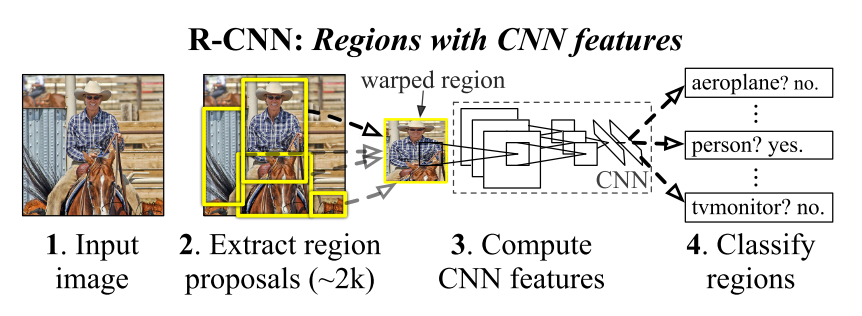

#### Frame localization

1. (X)Treating it as a regression problem -> low mAP in practice
2. (X)Sliding-window detector -> slow for high resolution images & inferior performance on images after many pooling layers
3. (Used)[selective search ](https://staff.fnwi.uva.nl/th.gevers/pub/GeversIJCV2013.pdf) : combining similar sub-regions

#### limited training data

1. pretraining the CNN on other datasets(training the feature extractor)
2. training the whole detector on the dataset for object detection

#### High IoU problem

1. Too many candidate regions -> high IoU
2. Solution -> NMS: "Given all scored regions in an image, we apply a greedy non-maximum suppression (for each class indepen- dently) that rejects a region if it has an intersection-over- union (IoU) overlap with a higher scoring selected region larger than a learned threshold"

#### why SVM -> loose threshold during fine-tuning period

1. During fine-tuning period, the author want to reduce overfitting, so we used a loose threshold: IoU > 0.5 -> object; IoU < 0.5 -> background
2. During SVM training period, the author used the validation set to choose a reasonable threshold:  IoU > 0.3 -> ignored; GT -> positive; IoU < 0.3 -> negative
3. loose threshold -> the softmax has limited classification capability -> use SVM instead

#### bounding box regression

bounding box regression -> move our predicted bounding box torward the ground truth bounding box(GT) -> higher classification accuracy

IDEA: find funtion f let: 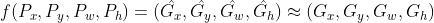 where the predicted bounding box is 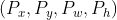 and the ground truth bounding box(GT) is 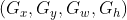 -> translation + telescopic transformation -> learning four transformation -> learning four linear transformation if the IoU > 0.6(Proposal & Ground Truth)

1. translation transformation:   
Ground Truth(6): 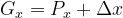, define scaling constant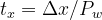 where 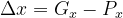.    
Approximation(1): 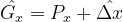, 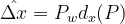, 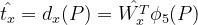

2. telescopic transformation:    
Ground Truth(8): 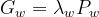, define scaling constant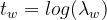 where 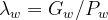.    
Approximation(3): 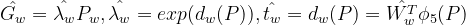

3. optimization of Weights:    
The L2 Loss with regularizaiton was used to minimize the eculidian distance between the t and t_hat.   
And the regularizaiton is important: the lambda was set to 1000 based on a validation set

4. Why linear transformation?    
When the Proposal is similar to the Ground Truth(IoU > 0.6), the telescopic transformation can also be approximated as a linear transformation.
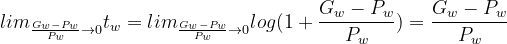
 

>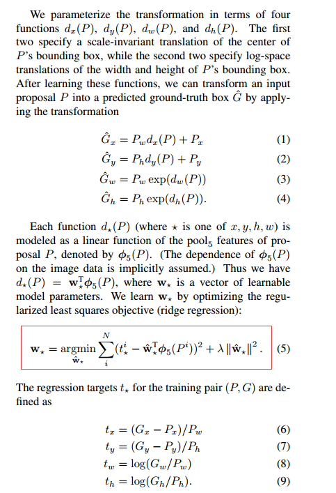

 

### Evaluation

Architecture evaluation

>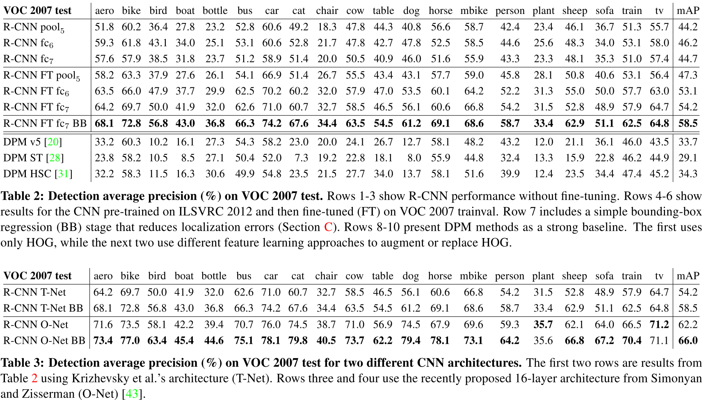 

     

fine-tuninng didn't change the sensitivity
>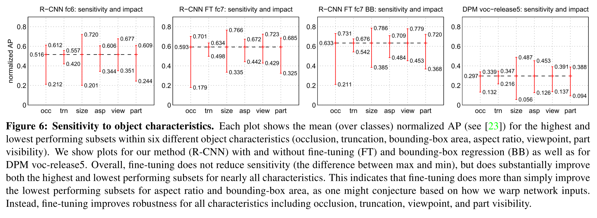

#### ablation study -> explore the key factors

1. removing layers -> conv layers are more important
2. removing or adding layers -> better train-val-set splits

#### pros and cons

pros:

>1. candidate areas
>2. CNN
>3. Bounding box regression

cons:

>1. Training is expensive in space and time
>2. redundant calculations on overlapped area
>3. Training is a multi-stage pipeline
>4. Object detection is slow

### Reference

(detection algorithm)[7] N. Dalal and B. Triggs. Histograms of oriented gradients for human detection. In CVPR, 2005.

(hard negative mining)[17] P. Felzenszwalb, R. Girshick, D. McAllester, and D. Ra- manan. Object detection with discriminatively trained part based models. TPAMI, 2010. 2,

(erroe diagnoes)[23] D. Hoiem, Y. Chodpathumwan, and Q. Dai. Diagnosing error in object detectors. In ECCV. 2012.

(detection algorithm)[29] D. Lowe. Distinctive image features from scale-invariant keypoints. IJCV, 2004.

(hard negative mining)[37] K. Sung and T. Poggio. Example-based learning for view- based human face detection. Technical Report A.I. Memo No. 1521, Massachussets Institute of Technology, 1994. 4

## Fast R-CNN

### Summary

1. End-to-end(no cashing features to disk, no post hoc training) training is important for very deep networks
2. Multi-task training is feasible and efficient
3. To reduce redundant calculation, we should extract features from a whole image instead of highly-overlaped RoIs
3. train all layers of the network is crucial, especially for the RoI Pooling layers and some conv layers
3. softmax could replace SVM
4. Sparse object proposals(2k) appear to improve detector quality

### Main Problems

1. No sharing computation in R-CNN
2. Slow Multistage pipeline
3. freezed conv layers in SPPnet

### Method

#### pipeline
(RoIs from the same image share computation and memory in the forward and backward passes)
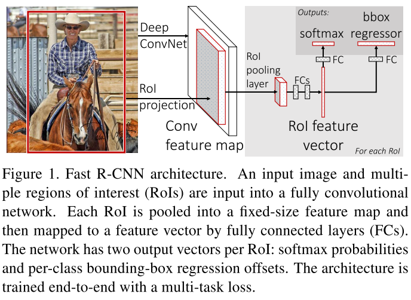 

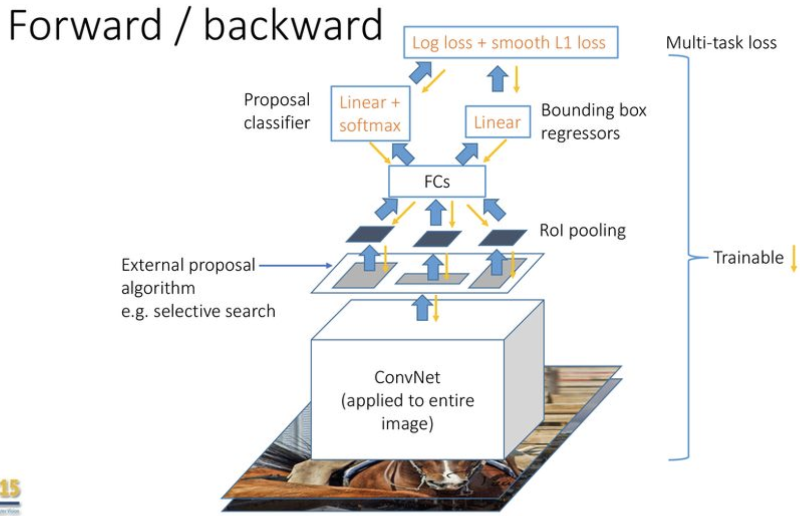              
(from:https://slideplayer.com/slide/17875576/)

#### RoI pooling(rectangular maxpooling)

1. A special max-pooling
 
             
(from https://deepsense.ai/region-of-interest-pooling-explained/)

2. backprop of RoI pooling      
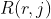 refers to the jth sub-region in the rth IoU.    
To calculate the xi, you have to iterate through all ; If the xi is the maximum value in (which means that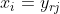), the 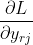 will be accumulated.

>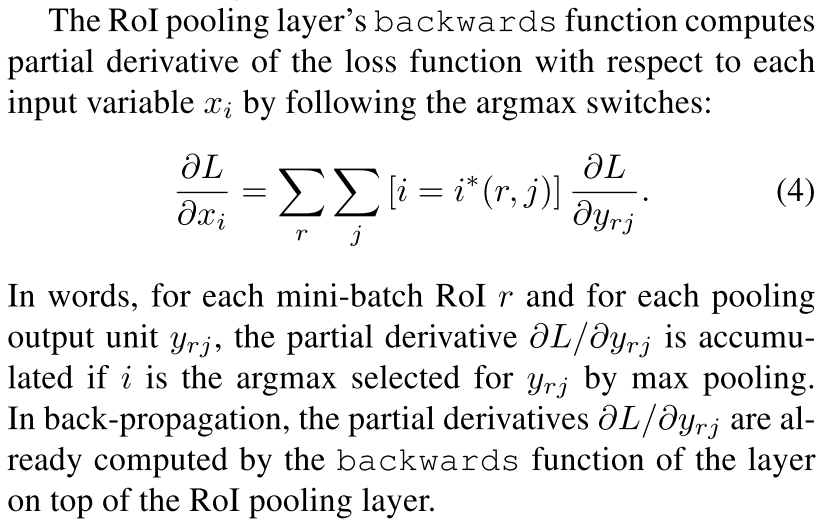 

#### pretraining

pretrained VGG-16 -> replace the max-pooling in VGG with RoI pooling -> replace the last fc layer and softmax with fc+softmax and fc+bbox regressor

#### Multi-task training

1. "Jointly optimizes a softmax classifier and bounding-box re- gressors, rather than training a softmax classifier, SVMs, and regressors in three separate stages"
2. Formula:
Classification loss: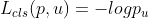 is the log loss of the true class u.    
Bbox Regression loss: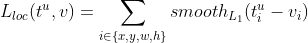, in which 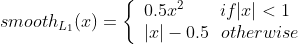.   
The smooth L1 loss is less sensitive to outliers.   
The Iverson bracket(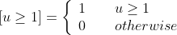) is used to exclude the background(u=0).  
The lambda is used to weight between two losses.    
Finally:
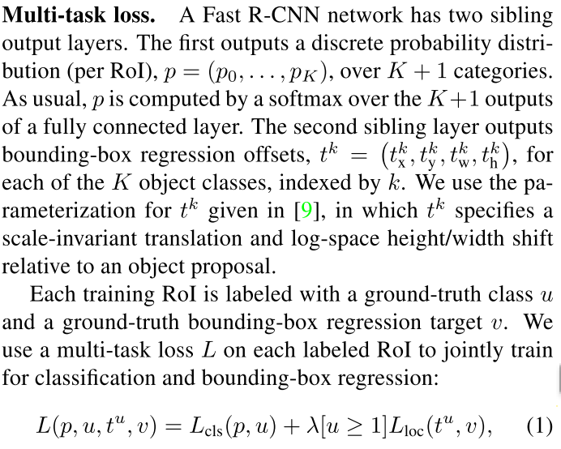 
3. The Multi-task training could reduce training and testing time greatly(due to  the simplified pipeline) and improve the mAP slightly(due to the shared representation(ConvNet)).
4. The form of the loss function for multi-task training is generally like this：L = L1 + kL2

#### detection time

1. The network takes as input an image (or an image pyramid, encoded as a list of images) and a list of R object proposals to score
2. outputs a class posterior probability distribution p and a set of predicted bounding-box offsets relative to r (each of the K classes gets its own refined bounding-box prediction)
3. We then
perform non-maximum suppression independently for each class using the algorithm and settings from R-CNN

#### Mini-batch sampling

1. N=2 images, 64 RoIs from each image
2. obj: take 25% of the RoIs from Ps that have IoU>=0.5 with a GT. These RoIs comprise the examples labeled with a foreground object class, i.e. u >= 1
4. back ground: 0.1 <= IoU <= 0.5
5. hard example mining: IoU <= 0.1

#### Softmax could replace SVM

> 

#### Truncated SVD for faster detection 

>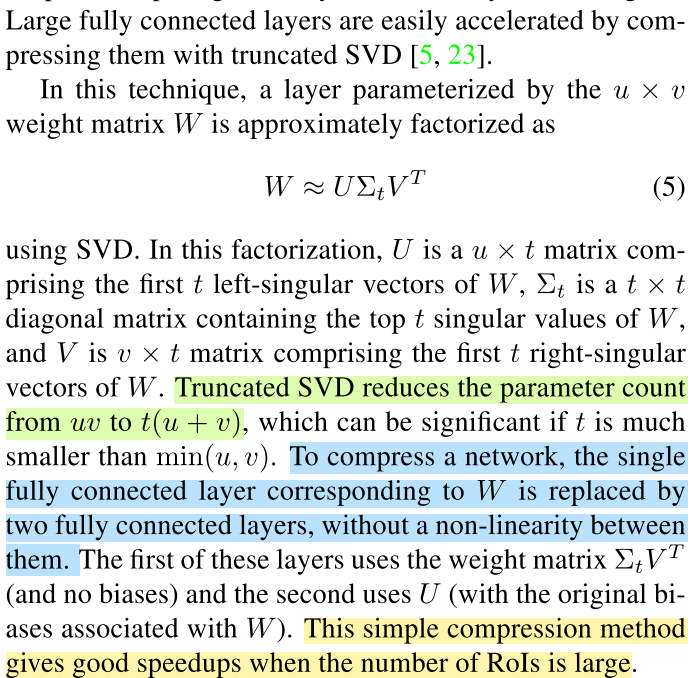 

>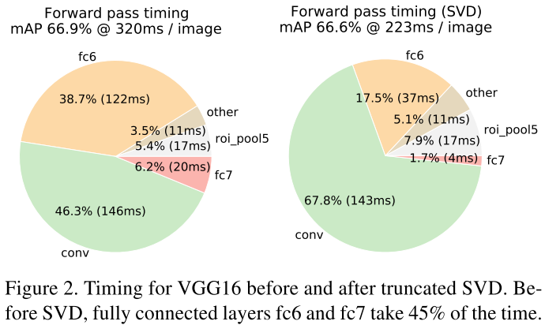 

#### Appropriate amount of proposals

1. "swamping the deep classifier with more proposals does not help, and even slightly hurts, accuracy."
2. AC is't align to acc

>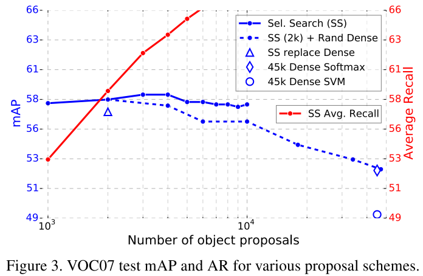 

#### which layer to fine-tune

1. fine-tune -> RoI layers
2. only some conv layers are critical
3. freeze conv layers would decrease mAP for very deep nets

### Evaluation

>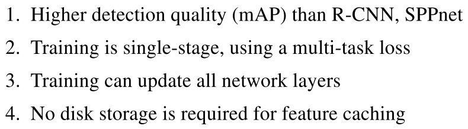 

Sharing computation and simplified pipeline->Fast
>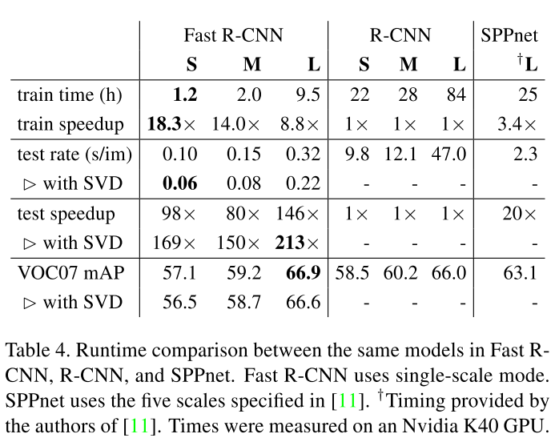 

Multi-task training -> Acc+
>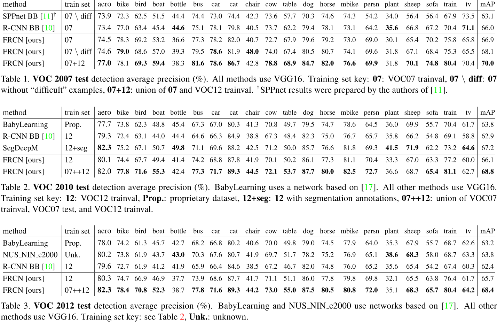 

## Faster R-CNN

### Summary

1. You could perform nn on various things, including propasal generation.   
2. Use anchors instead of sliding window or pyramids.    
3. feature sharing is the key technique to significantly accelerate the detection.   
4. 4-Step Alternating Training -> train multi-stage networks. 
5. NMS does not harm the detection mAP and may reduce false alarms

### Main Problems

1. The bottleneck of running time: region computation(slow Selective Search)
2. Some object detection method like MultiBox isn't translation-invariant
3. Limited detection capability of sliding window

### Method

#### pipeline 

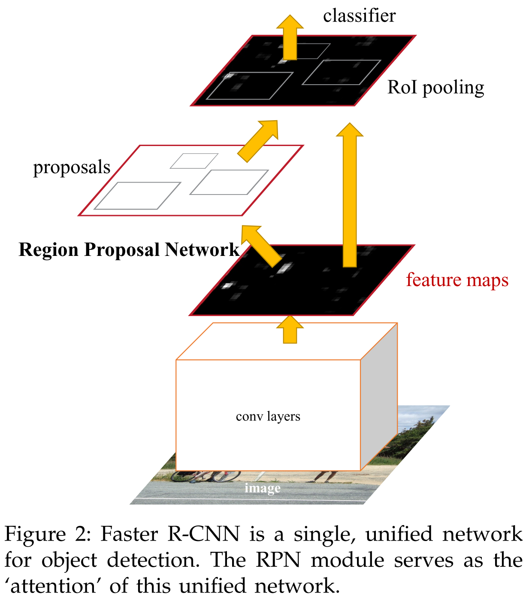 

**The network will only back prop on the blue lines.**    
**There is no back prop on the red lines.**   
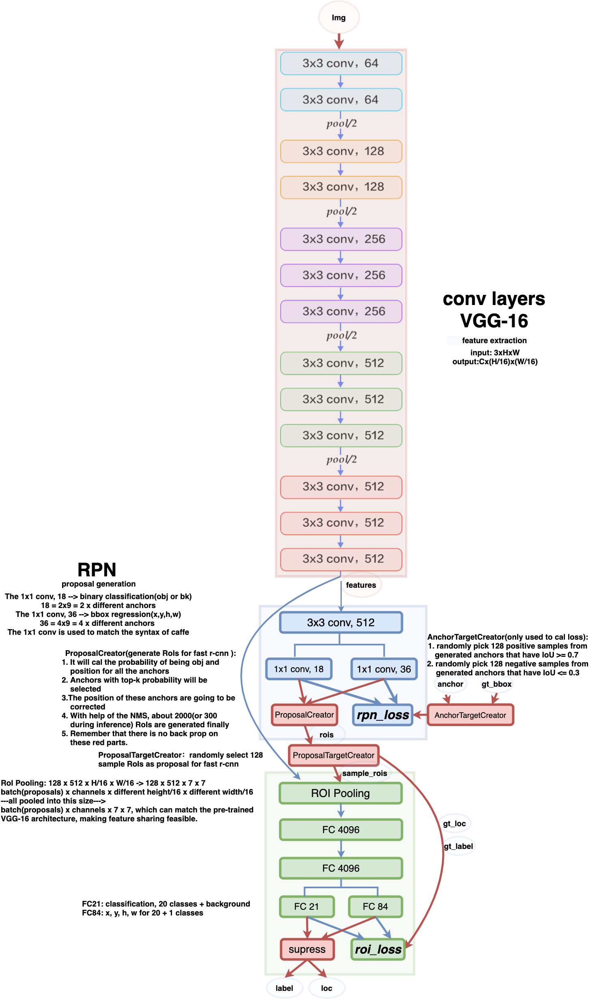

#### RPN: Region Proposal Networks(much faster than SS)

Instead of the traditional selective search algorithm, a neural network named region proposal networks is used to learn how to select proposals.

1. There is a nxn sliding window(the blue 3x3 conv, 512) sliding on the feature map extracted by the conv layers of VGG-16.     
2. Some anchors(9 anchors) based on the sliding window are used for finer detection:          
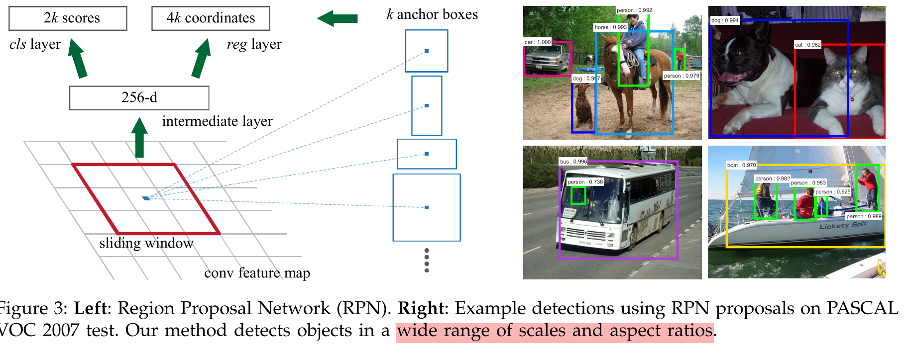         
About 20000(WHk) regions would be generated by the sliding anchors.      
The anchors are Translation-Invariant(just like conv layers).    
The design of multi- scale anchors is a key component for sharing features **without extra cost** for **addressing scales**.   
3. Loss function: 
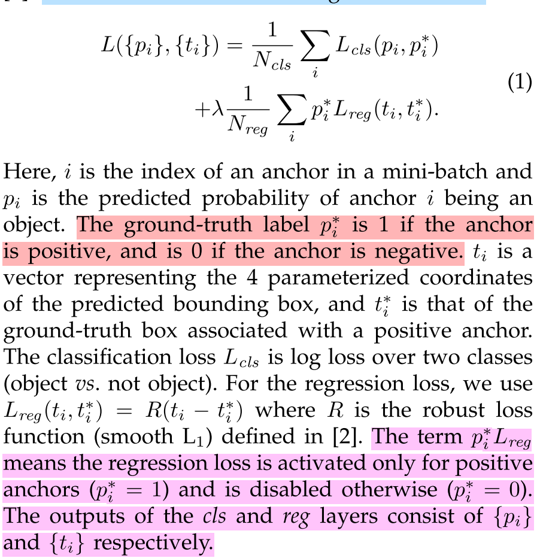.          
"By default we set λ = 10, and thus both cls and reg terms are roughly equally weighted; The λ is insensitive in a wide range."    
The bounding-box regression is actually anchor & GT regression.     
"Each regressor is responsible for one scale and one aspect ratio, and the k regressors do not share weights. As such, it is still possible to predict boxes of various sizes even though the features are of a fixed size/scale, thanks to the design of anchors."
4. Feature sharing: the conv layers of VGG-16 are shared between RPN and fast r-cnn; The pretrained conv layers and fc layers of VGG-16 can apply on this architecture.  

#### Training 

##### 4-Step Alternating Training

1. RPN training: pre-trained model + end-to-end fine-tuning for the region proposal task.   
2. Fast R-CNN training: train a separate detection network(also initialized by the ImageNet-pre-trained model, no sharing conv layers now) by Fast R-CNN using the proposals generated by the step-1 RPN.   
3. use the detector network to initialize RPN training + fix the shared convolutional layers + only fine-tune the layers unique to RPN (now sharing features)
4. fix the shared convolutional layers + only fine-tune the layers unique to Fast R-CNN

#### Approximate joint training

1. the forward pass generates region proposals which are treated just like fixed, pre-computed proposals when training a Fast R-CNN detector.
2. backward propagated signals from both the RPN loss and the Fast R-CNN loss are combined
3. we have empirically found this solver produces close results, yet reduces the training time by about 25-50% comparing with alternating training.

#### Non-approximate joint training

This is a nontrivial problem and a solution can be given by an “RoI warping” layer as developed in other papers, which is beyond the scope of this paper.

### Evaluation

1. With the convolutional features shared, the RPN alone only takes 10ms computing the additional layers.
   
2. the RPN method behaves gracefully when the number of proposals drops from 2000 to 300, which means that Faster R-CNN benefits more from better features; The better features are provided by the RPN.    
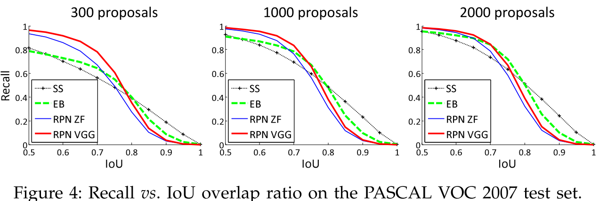

3. method comparison:
>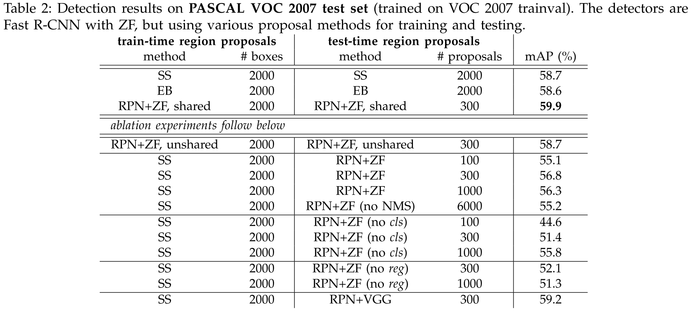

4. anchor scale:
>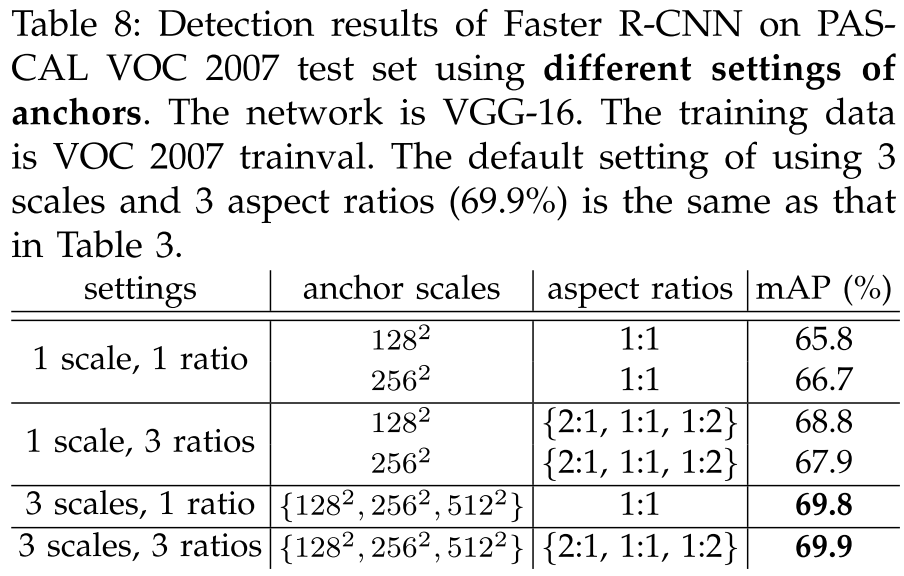

5. lambda: lambda which can balanc the scale of the losses(same scale) is better:
>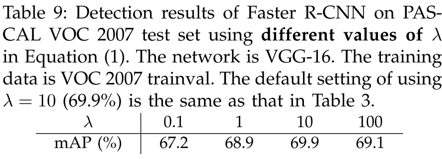

## Additional reading

[https://blog.csdn.net/v_JULY_v/article/details/80170182](https://blog.csdn.net/v_JULY_v/article/details/80170182)   
[https://slideplayer.com/slide/17875576/](https://slideplayer.com/slide/17875576/)       
[https://zhuanlan.zhihu.com/p/32404424](https://zhuanlan.zhihu.com/p/32404424)