# Real-Time Style Transfer, IN, CIN, AdaIN

(Vanilla)[Perceptual Losses for Real-Time Style Transfer and Super-Resolution](https://arxiv.org/abs/1603.08155) \[1]     
(IN)[Instance Normalization: The Missing Ingredient for Fast Stylization](https://arxiv.org/abs/1607.08022)  \[2]     
(CIN)[A LEARNED REPRESENTATION FOR ARTISTIC STYLE](https://arxiv.org/abs/1610.07629) \[3]    
(CoMatch)[Multi-style Generative Network for Real-time Transfer](https://arxiv.org/abs/1703.06953) \[4]         
(**AdaIN**)[Arbitrary Style Transfer in Real-time with Adaptive Instance Normalization](https://arxiv.org/abs/1703.06868)\[5]\

## Summary

1. Style transfer can be achieved by a single forward propagation
2. Generally, the perceptual loss is better than the per-pixel loss
2. perceptual loss + gram matrix or other statistics(MRF, other second-order statistics)
3. Cnn could be used to define losses in image reconstruction tasks(VGG)
4. With the affine transformation after the normalization, style transfer can be done without extra training.
5. The model with IN converges faster and has better quanlity than the BN model. 
6. IN does perform a kind of style normalization

## Method \[1]

### Pipeline 

Overall: 

>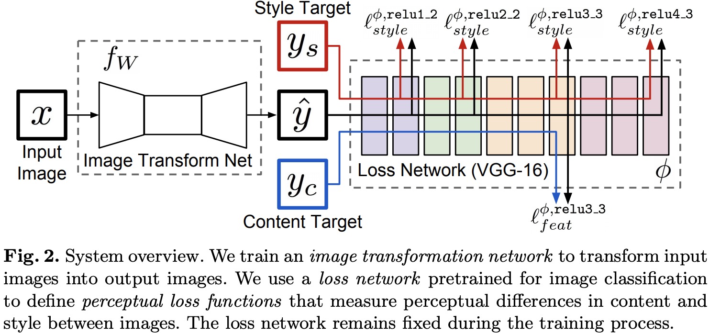

The transformer(with [instance normalization](https://arxiv.org/abs/1607.08022), Ulyanov et al.): 

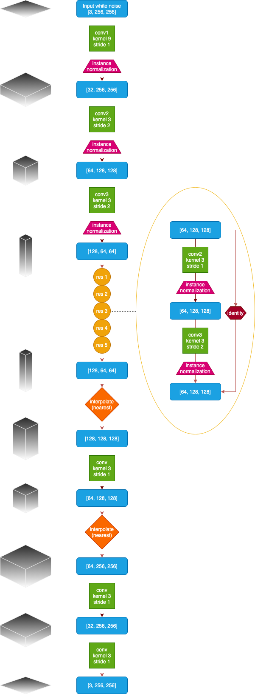

1. The architecture of the transformer is inspired by the network used in semantic segmentation.        
2. Transposed convolution in the original paper is replaced by a nearest-neighbor upsampling followed by a convolution

### VGG

The VGG is a **fixed**(no gradient descent) network which has been pre-trained on ImageNet. The VGG serves as a feature extractor to provide semantic and perceptual informations.  Then, the extracted features could be used to define loss function.    

### Downsample and Upsample(Transformer)

#### Downsample: 

conv layers, no pooling layer

#### Upsample:

fractionally-strided convolution(or transposed convolution) or various interpolate

#### Downsample + Upsample 

1. reduce computational cost
2. larger receptive field for each pixel in the generated image(more robust)

### Residual blocks

Increase the capacity of the network.

### Loss function

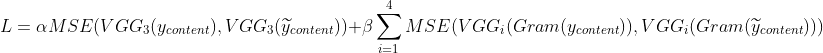
(optional: a total variation loss could be employed to encourage smoothness)

### Train & Test

During training, content images from a large dataset are forwarded through the transformer net and then evaluated by the loss function based on the VGG.

To generate(test) a image, a single content image will be passed through the transformer net to obtain the stylized image.

### Instance normalization\[2]

1. Intuitively, the batch normalization would normlize the images among the whole batch, blurring the information.
1. This method removes **instance-specific contrast information** from the content **content image**, because the result of stylish should not depend on the contrast of the content image. 
2. Methods with instance normalization converge faster than methods with batch normalization.

Formula:     
>Batch Normalization:
>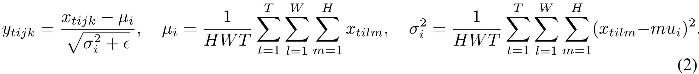
>Instance Normalization:
>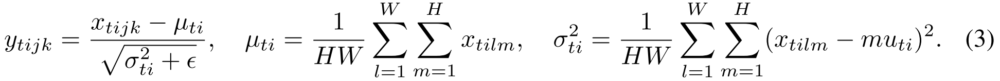
>1. "This prevents instance-specific mean and covariance shift simplifying the learning process."        
>2. "Differently from batch normalization, furthermore, the instance normalization layer is applied at test time as well."

Result:

>

### Conditional Instance Normalization(Multi-Style) \[3]

Intuitively, because the images are embedded in a linearly separabel space, separate affine transformation could learn to transform content embedding to different stylized images.       
    
CORE:    
>"Our work stems from the intuition that many styles probably share some degree of computation, and that this sharing is thrown away by training N networks from scratch when building an N- styles style transfer system."

>"All convolutional weights of a style transfer network can be shared across many styles, and it is sufficient to tune parameters for an affine transformation after normalization for each style."

--> Learning affine transformations for individual styles after every BN layers(sharing other parameters) is capable enough for real-time multi-style transformation.

Seperate parameters for different styles:     
>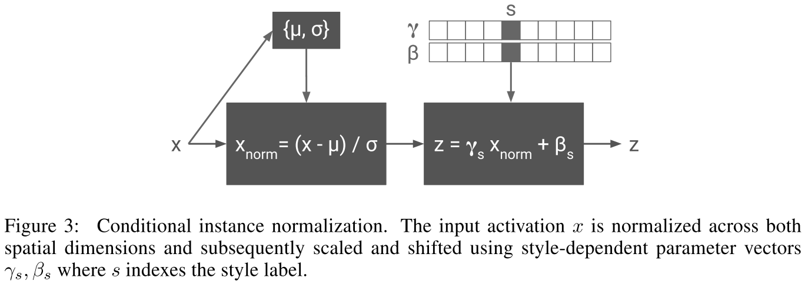 

During training, a style image together with its indexs are randomly chosen from a fixed set of styles.     
During testing, the content image is forwarded with corresponding affine transformation parameters.       

Result:
>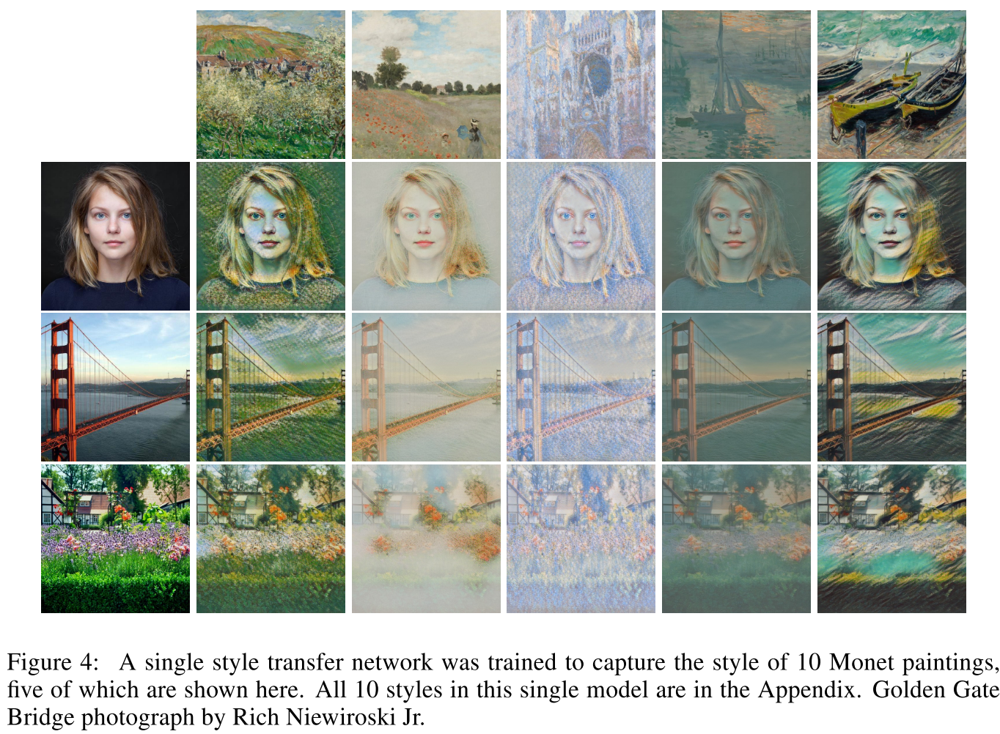

### CoMatch layer(style embedding)\[4]

CORE:
>"The comprehensive appearance of image style is fundamentally difficult to represent in 1D embedding space."
>
>"The 1D style embedding (featuremap mean and variance) fundamentally limits the potential of exploring finer behavior for style representations. Therefore, a 2D method(Gram matrix) is desired for finer representation of image styles."

Method:

1. Explicitly define the tranformations with formula in the tranformer.
2. 2D matrixes of the style embedding and the content embedding are "CoMatched" to define the tranformation output.

Pipeline:

>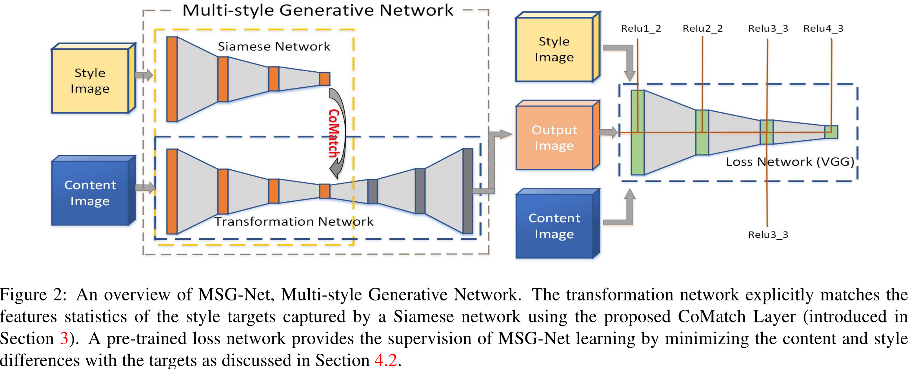

### AdaIN(Arbitrary-Style)\[5]
   
>"AdaIN performs style transfer in the feature space by transferring feature statistics, specifically the channel-wise mean and variance."     
>"**Unlike BN, IN or CIN, AdaIN has no learnable affine parameters.**"   
>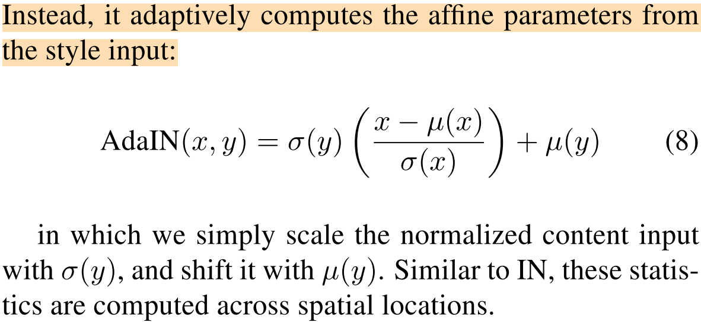

pipeline:    
>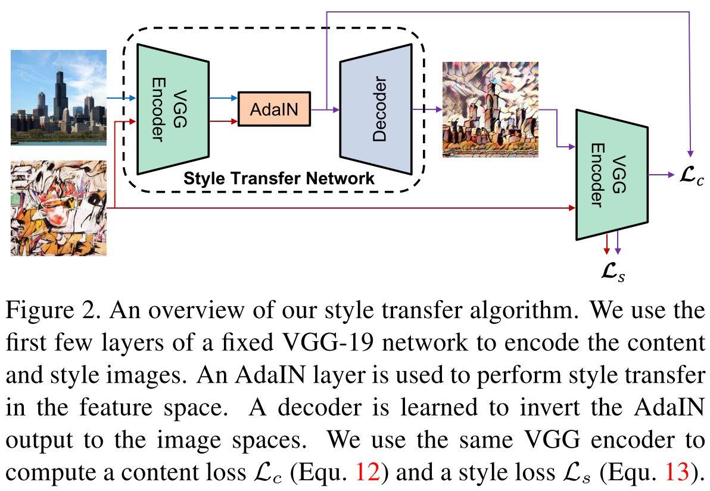
>"we do not use normaization layers in the decoder."

Loss:    
>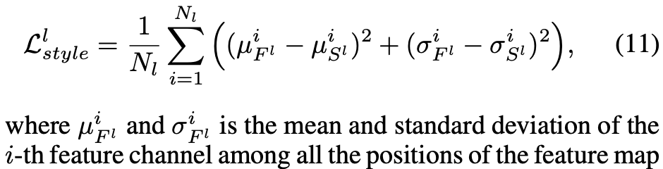

Result:       
>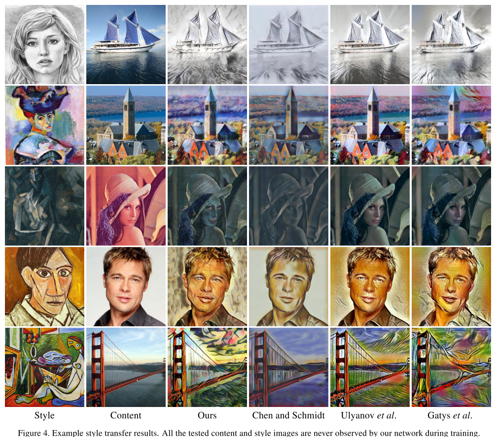

### Upsampling techniques

#### Checkerboard artifacts

1. Standard fractional-strided convolution with singular stride is likely to bring checkerboard like artifacts.([A popular blog explained it](https://distill.pub/2016/deconv-checkerboard/))
2. Traditional upsampling techniques(bilinear interpolation, bicubic...) + conv layer can neutralize the effect of checkerboard artifact. However, the receptive field would decrease significantly.
3. Upsampled convolution[4] layers successfiully avoid upsampling artifacts, although it need 4x parameters: \[4]   

>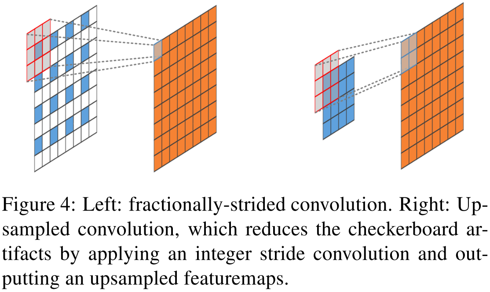

####	upsampling residual block\[4]

>"Passing identity all the way through the generative network enables the network to extend deeper and converge faster."

## Evaluation\[1]

>**feature reconstruction**      
>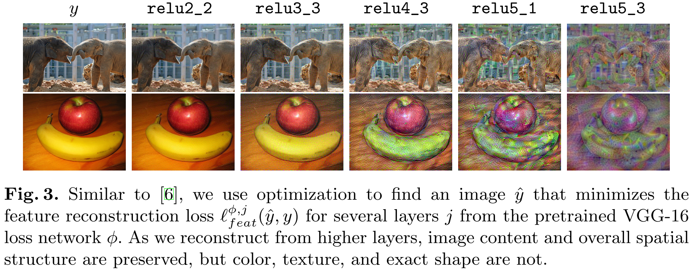        
>
>
>**style reconstruction**     
>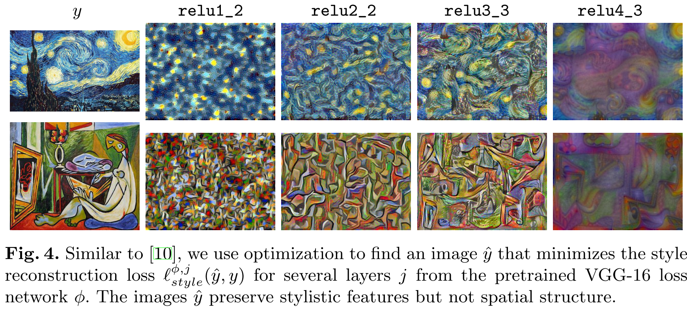     
>
>
>**result**      
>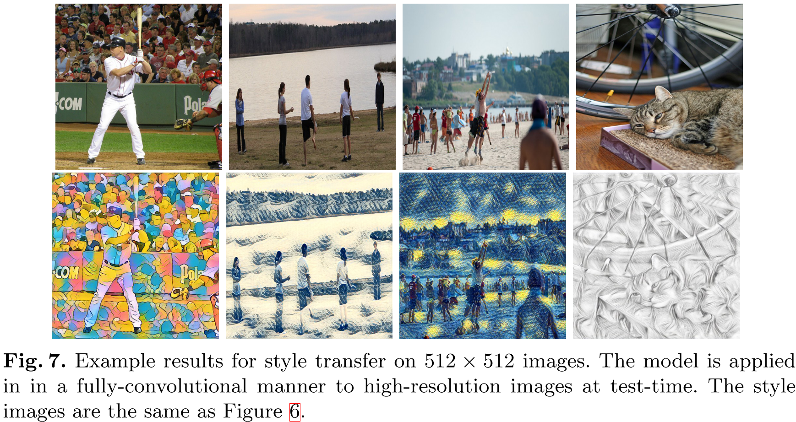

## The Reference of papers

(transformer) Long, J., Shelhamer, E., Darrell, T.: Fully convolutional networks for semantic segmentation. CVPR (2015)

(transfromer) Noh, H., Hong, S., Han, B.: Learning deconvolution network for semantic segmen- tation. arXiv preprint arXiv:1505.04366 (2015)

(coloring) Cheng, Z., Yang, Q., Sheng, B.: Deep colorization. In: Proceedings of the IEEE International Conference on Computer Vision. (2015) 415–423

(code)https://github.com/pytorch/examples/tree/master/fast_neural_style

(checkerboard)http://distill.pub/2016/deconv-checkerboard/

## Reference 

[1] Johnson, Justin & Alahi, Alexandre & Fei-Fei, Li. (2016). Perceptual Losses for Real-Time Style Transfer and Super-Resolution. 9906. 694-711. 10.1007/978-3-319-46475-6_43.

[2] Ulyanov, Dmitry & Vedaldi, Andrea & Lempitsky, Victor. (2016). Instance Normalization: The Missing Ingredient for Fast Stylization. 

[3] Dumoulin, Vincent & Shlens, Jonathon & Kudlur, Manjunath. (2016). A Learned Representation For Artistic Style. 

[4] Zhang, Hang & Dana, Kristin. (2017). Multi-style Generative Network for Real-time Transfer. 

[5] Huang, Xun & Belongie, Serge. (2017). Arbitrary Style Transfer in Real-time with Adaptive Instance Normalization. 