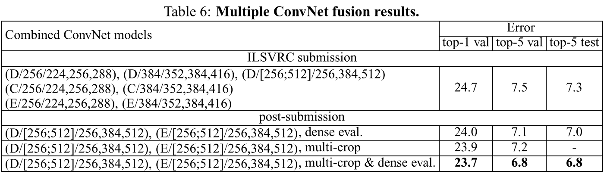
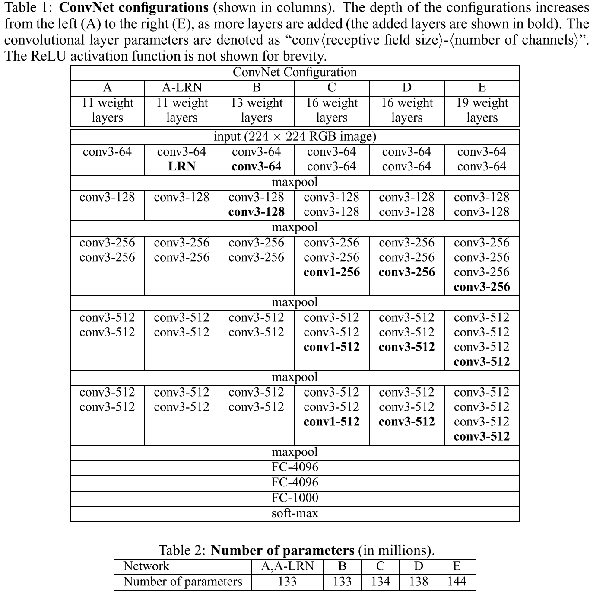
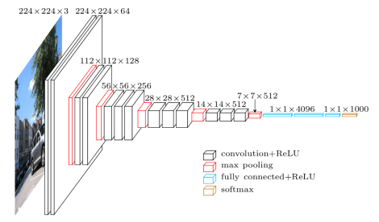
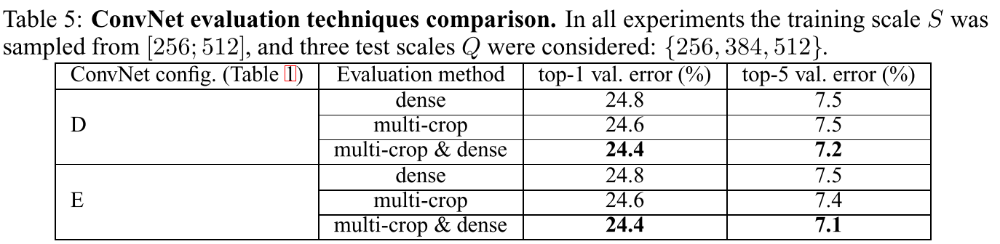
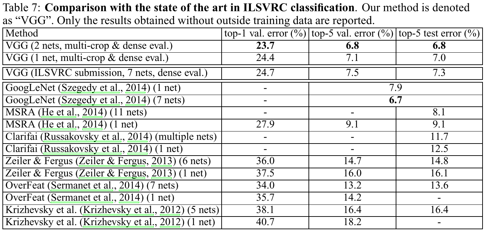

# Very deep convolutional  networks for large-scale image recognition

## Summary

1. Use Multiple 3x3 conv. layers instead of a single layer with large kernel.
2. The depth is critical in visual representations.(neither too shallow nor too deep, just about to saturate)
3. Combine multiple convnet models(model fusion) to obtain better performance.

4. Use muti-scale training and muti-scale Testing
5. Use pre-training

## Research Object

CNN architecture for imagenet

## Problem Statement

Improve the original architecture of Krizhevsky et al

## Method

### Small Kernel 

1. Small 3x3 kernels is the smallest size to preserve spacial structure
2. Multiple conv layers with 3x3 kernels have the same receptive field as a single layer with 7x7 kernel but it need **less params**(less epoch to converge, reduce overfitting).
3. Multiple conv layers with 3x3 kernels makes the decision function more discriminative.
4. 1x1 conv could add non-linearty to the network, but 3x3 conv has lower top-1 error(3x3 contains spacial context).
5. we can steadily increase the depth(thus increase the non-linearty) by adding conv layers, which is feasible due to the small filters.
6. Use 2x2 Maxpooling to obtain more layers.
7. More channels for extracting features

### Achitecture

(D:VGG16)

\#0.5 dropout for the first two FC layers.  
\#only the last fc layer contains a softmax function     
\#if use us CrossEntropyLoss() in pytorch, the softmax function was added implicitly

### Details

1. batch size:256 
2. momentum:0.9
3. learning rate: 1e-2 /= 10
4. weight decay:5e-4
5. dropout: 0.5 for the first two FC layers
6. To further augment the training set, the crops underwent randomhorizontal flipping and randomRGB colour shift (Krizhevsky et al., 2012). Training
7. The LRN(local response normalization) is useless in this net

### Multiple GPUs

1. splitting each batch of training images into several GPU batches, processed in parallel on each GPU. After the GPU batch gradients are computed, they are averaged to obtain the gradient of the full batch

### Muti-Scale Training & Muti-Scale Testing

1. Training-time: Rescale the image randomly([256,512]) and then randomly crop 224x224 sub-img from it.
2. Test-time: Make predictions for the 224x224 randomly cropped sub-imgs of a single img, and then average them to get the final-prediction.
3. Predictions made for each , then the predictions were averaged to give a final prediction.

4. Dense&muti-crop has better performance

5. The last 3 FC layers have been changed to 3 conv layers in order to process img with different resolution.(the idea comes from OverFeat)

### Initialization

It is possible to initialise the weights without pre-training by using the random initialisation procedure of "Glorot, X. and Bengio, Y. Understanding the difficulty of training deep feedforward neural networks. In Proc. AISTATS, volume 9, pp. 249–256, 2010."

## Evaluation

## Reference 

1. Sermanet, P., Eigen, D., Zhang, X., Mathieu, M., Fergus, R., and LeCun, Y. OverFeat: Integrated Recognition, Localization and Detection using Convolutional Networks. In Proc. ICLR, 2014

2. Szegedy, C., Liu, W., Jia, Y., Sermanet, P., Reed, S., Anguelov, D., Erhan, D., Vanhoucke, V., and Rabinovich, A. Going deeper with convolutions. CoRR, abs/1409.4842, 2014.

3. LeCun, Y., Boser, B., Denker, J. S., Henderson, D., Howard, R. E., Hubbard, W., and Jackel, L. D. Backpropa- gation applied to handwritten zip code recognition. Neural Computation, 1(4):541–551, 1989.

4. Glorot, X. and Bengio, Y. Understanding the difficulty of training deep feedforward neural networks. In Proc. AISTATS, volume 9, pp. 249–256, 2010.

## W P