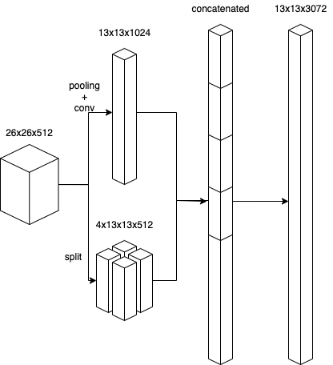

# YOLO v1-v5

## YOLO v1

### Conclusion

1. One-stage method(dense prediction) -> faster
2. regression methods for object detection is feasible

### Pipeline

         
e.g. 7 x 7 x (2*5 + 20) tensor

Details:

1. Each grid cell predicts B bounding boxes and confidence scores for those boxes.
2. Each bounding box consists of 5 predictions: x, y, w, h, and confidence.  

Loss function:
         
line 1, 2: coordinate loss        
line 3: confidence loss of boxes with objects       
line 4: confidence loss of boxes without objects       
line 5: classification loss of boxes with objects       

Why sqrt(w), sqrt(hi):     
"Our error metric should reflect that small deviations in large boxes matter less than in small boxes. To partially address this we predict the square root of the bounding box width and height instead of the width and height directly."

### Evaluation

pros Real-Time(unified detection)       

**YOLO can accurately detect the background but it struggles to localize object correctly.**      

And YOLO can generize well on person detction on artworks.  

cons:  

Each grid cell only predicts two boxes and can only have one class -> strong spatial constraints on bounding box predictions + **coarse features for predicting bounding** + struggles with small objects that appear in groups, such as flocks of birds + lower recall     

Our loss function treats errors the same in small bounding boxes versus large bounding boxes. A small error in a large box is generally benign but a small error in a small box has a much greater effect on IOU

## YOLO v2

### Conclusion

1. use anchor boxes
2. The transition time for different resolution images is critical.
3. Cluster algorithm is useful for design anchors.  
4. Predicting offset is much easier, because it has some constraint which could be additional imformations and the optimization is easier.  
5. **Extract fine-grained features from images**
6. Hierarchical classification

### Additional features

#### Batch Normalization

The bn layer can reduce overfitting, making mAP increased by 2%.      
With batch normalization we can remove dropout from the model without overfitting.    

#### High Resolution Classifier

In YOLO V1: After pretrained on 224x224 image, the YOLO will be directly trained on 448x448 images.
In YOLO V2: After pretrained on 224x224 image, the YOLO will be fine tuned on the classification network Imagenet and then trained on 448x448 images.    
This transition time is critical that it provides 4% increase of 4% mAP.

#### Convolutional With Anchor Boxes

Predicting offsets instead of coordinates simplifies the problem and makes it easier for the network to learn.     
We remove the fully connected layers from YOLO anduse anchor boxes to predict bounding boxes.    

#### Dimension Clusters     

Hand picked anchors can be picked by **k-means clustering**(), which has better IoU:
      

what we really want are priors that lead to good IOU scores, which is independent of the size of the box: **d(box, centroid) = 1 − IOU(box, centroid)**       

#### Direct location prediction(using grid cell to predict bbox)

When using x = (tx * wa) - xa, the model is unstable, because any anchor box can end up at any point in the image.      
So, instead of predicting offsets we follow the approach of YOLO and predict location coordinates **relative to the location of the grid cell**.   

#### Fine-Grained Features

The passthrough layer **concatenates** the **higher resolution features** with the **low resolution features** by stacking adjacent features into **different channels** instead of spatial locations, similar to the identity mappings in ResNet.     

          
different channels:

 
#### Multi-Scale Training

"Every 10 batches our network randomly chooses a new image dimension size."    
"This regime forces the network to learn to predict well across a variety of input dimensions."     

#### Hierarchical classification

This method can be used to combine different dataset that are not mutually exclusive with joint classification and detection.
The Hierarchical classification also offers a richer, more detailed output space for image classification.   

Joint classification and detection: "When our network sees a detection image we backpropagate loss as normal. For classification loss, we only backpropagate loss at or above the corresponding level of the label."     
"For example, if the label is “dog” we do assign any error to predictions further down in the tree, “German Shepherd” versus “Golden Retriever”, because we do not have that information."    

##### Formula:    

##### Softmax:     

##### WordTree:   

### Evaluation

## YOLO v3

### Conclusion

The YOLO V3 is mainly based on the YOLO V2.   
1. Bounding Box prediction: offset prediction based on anchors
2. Class prediction: softmax->binary logistic regression(multilabel)
3. Fine-grained feature extraction

### Bounding Box Prediction

It is exactly the same as one in YOLO v2.

"Unlike [17] our system only assigns one bounding box prior **for each ground truth object**(still many prior for each grid). If a bounding box prior is not assigned to a ground truth object it incurs no loss for coordinate or class predictions, only objectness."     

In breif, only one bbox prior will be selected from anchors for each GT in order to save time.   

### Class Prediction

Multiple independent logistic classifier were used instead of a single softmax to generize well on multilabel datasets.

### Predictions Across Scales(Fine-Grained Features)

(from: https://blog.csdn.net/leviopku/article/details/82660381)

### Things didn't work

### Evaluation

## YOLO v4

### Conclusion

An excellent example of model aggregation:       
1. collect informations about different models and tricks      
2. analyse the pros and cons of these methods      
3. decompose the model and reorganize it with various combinations    
4. extensive ablation tests       
5. compare those combinations      
6. additional improvements        

### Object detection models

1. BackBones: networks pre-trained on ImageNet.     
2. Necks: are used to collect feature maps from different stages.    
3. Heads: can predict classes and bounding boxes of objects. 

  

### Bag of freebies

We call these methods that only change the training strategy or only increase the training cost as “bag of freebies.”

#### data augmentation 

photometric distortion: adjust the brightness, contrast, hue, saturation, and noise of an image         
geometric distortion: random scaling, cropping, flipping, and rotating       
simulating object occlusion: random erase, CutOut, hide-and-seek, grid mask  

##### feature map augmentation

DropOut, DropConnect, and DropBlock

##### mutiple image data augmentation 

MixUp, CutMix

##### style transfer

style transfer GAN is also used for data augmentation, and such usage can effectively reduce the texture bias learned by CNN

#### semantic distribution bias

##### data imbalance between different classes

solution:     
1. this problem is often solved by hard negative example mining or online hard example mining in **two-stage object detector**.         
2. focal loss     
3. label smoothing: convert hard label into soft label for training, which can make model more robust      
4. better soft label: knowledge distillation      

#### BBox regression 

##### directly estimate

The traditional object detector usually uses **Mean Square Error (MSE)** to **directly** perform regression on the center point coordinates and height and width of the BBox, i.e., {x-center, y-center, w, h}, or the upper left point and the lower right point, i.e., {x-top left, y-top left, x-bottom right, y-bottom right}

##### anchor based method 

As for anchor-based method, it is to **estimate the corresponding offset(easier)**, for example {x-center offset, y-center offset, w-offset, h-offset} and {x-top left offset, y-top left offset, x-bottom right offset, y-bottom right offset}

##### IoU loss

"Because IoU is a scale invariant representation, it can solve the problem that when traditional methods calculate the l1 or l2 loss of {x, y, w, h}, the loss will increase with the scale. Recently, some researchers have continued to improve IoU loss."

1. IoU loss: scale invariant
2. GIoU loss: shape and orientation of object are considered 
3. DIoU loss: distance of the center of an object are considered 
4. CIoU loss: the overlapping area, the distance between center points, and the aspect ratio are considered

### Bag of specials

For those plugin modules and post-processing methods that only increase the inference cost by a small amount but can significantly improve the accuracy of object detection, we call them “bag of specials”.

#### receptive field enhancement

SPP      
ASPP     
RFB         

#### attention module

##### channel-wise attention

Squeeze-and-Excitation (SE)

##### point- wise attention

Spatial Attention Module (SAM)

#### Feature integration

early practice: skip connection, hyper-column
feature pyramid integration:     
SFAM: "use SE module to execute channel-wise level re-weighting on multi-scale concatenated feature maps"      
ASFF: "it uses softmax as point-wise level re-weighting and then adds feature maps of different scales."      
BiFPN: "execute scale-wise level re-weighting, and then add feature maps of different scales"         

#### activation function

ReLU, LReLU, PReLU, ReLU6, SELU, Swish, hard-Swish, Mish

#### Post processing method 

NMS: "can be used to filter those BBoxes that badly predict the same object, and only retain the candidate BBoxes with higher response".     

greedy NMS: context information is considered     

soft NMS: it considers the problem that the occlusion of an object may cause the degradation of confidence score in greedy NMS with IoU score  

DIoU NMS: the information of the center point distance is added

### selection 

#### architecture selection

     
"Finally, we choose CSPDarknet53 backbone, SPP additional module, PANet path aggregation neck, and YOLOv3 (anchor based) head as the architecture of YOLOv4"

#### Selection of BoF and BoS

#### Overall achitecture

### Additional improvements

#### Mosaic data augmentation

 

#### Self-Adversarial Training(SAT) data augmentation

 

#### Cross mini-Batch Normalization (CmBN)

 

#### Modified SAM and PAN

 

### Evaluation

## [YOLO v5](https://github.com/ultralytics/yolov5)

